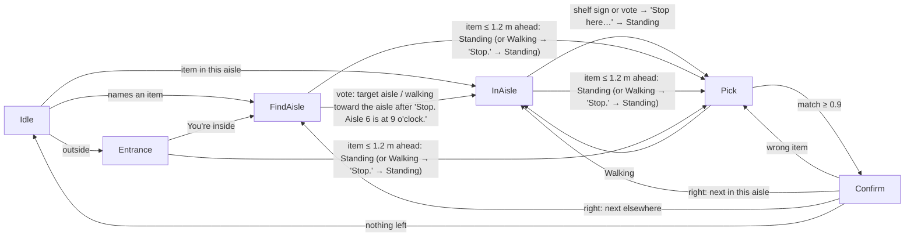

# DigiFinder: Implementation Plan

The single build document for DigiFinder, a native iOS "digital guide dog" app. It holds everything needed to implement the app: decisions, architecture, the agent execution plan, the full behavior spec, milestones with confidence scores, data tooling, and reference code.

- **Product context** lives in `prd.md` (team document). **This file wins on technical and behavioral decisions**; `prd.md` explains the why. If they conflict, note it in `CONTRACT_CHANGES.md` and follow this file.
- **Tooling:** `tools/build_product_db.py` and `tools/aisle_map.json` are written out from **Appendix A** in Wave 1, copied exactly (already tested). They run once on the Mac, never in the app.

**Confidence scale** (shown as **[n]** on tasks)
| Score | Meaning |
|---|---|
| 9–10 | Standard Apple APIs, well understood |
| 7–8 | Known approach; needs on-device tuning |
| 5–6 | Works in principle; real risk |
| ≤ 4 | Uncertain in the time available |

---

## Table of contents
0. Rules for every session
1. Product summary
2. Decisions and constraints
3. Architecture
4. Agent execution plan
5. Behavior spec
6. MVP UI
7. Data files and tooling
8. Milestones
9. Reference snippets
10. Verify on device
11. Stretch
12. Decision log

Appendix A. `tools/` files (copy exactly)

---

## 0. Rules for every session

- **Swift 5 language mode**, deployment target **iOS 17.2**. SwiftUI + MVVM.
- **The repo already exists** with a GitHub Swift `.gitignore` and a `README.md`. Start every session by listing the repo and use the real paths. Keep both files: append to `.gitignore`, never replace it; only add a section to `README.md` (Wave 3). Never move or rename Xcode files.
- **Never hand-edit `.pbxproj`.** The app target uses Xcode synchronized folders; new files in the folder tree are picked up automatically. The local Swift package (`DigiFinderCore`) is added to the project once by a human in Xcode (M0).
- **The cloud environment is Linux and cannot build iOS code.** Only `DigiFinderCore` (pure Swift) can be built and tested there (§4). The iOS app is built on a Mac (§4.5).
- **Devices:** demo on **iPhone 13 Pro** (LiDAR + wide + ultra-wide; verified: `.builtInLiDARDepthCamera` and `.builtInUltraWideCamera` run together in one `AVCaptureMultiCamSession`). Development on **iPhone 13** (no LiDAR → fallback path). **Simulator** must build and launch to a "Camera unavailable" screen with a debug panel (typed requests + event buttons) that drives the session.
- **Guard every hardware call.** No force-unwrapped devices, no unconditional sessions, check haptics capability.
- **Never break the build.** Each milestone leaves the app launchable.
- **Safety lane rules:** depth frame → haptic in < 50 ms, never on the main thread, never touches the network.
- Secrets live in `DigiFinder/Resources/Secrets.plist` (gitignored; keys `GeminiAPIKey`, `GeminiModel`, `OFFContact`), read at runtime. Missing file → online extras off ("Online help isn't set up."); the app still builds and runs. Never hardcode keys.
- **`tools/` comes from Appendix A, copied exactly. Do not rewrite, refactor or "improve" it.** Cloud agents never run it (several-GB download). It runs once on the Mac (§4.5), by a human or a terminal coding agent, and its outputs go to `DigiFinder/Resources/`. Edit `aisle_map.json` only when asked. If `products.sqlite` is missing, the app must still work from `extraProducts` (§7.2).

---

## 1. Product summary

A hands-free **digital guide dog** for blind and low-vision shoppers in indoor spaces, starting with grocery stores. The iPhone hangs on a lanyard at chest height, cameras facing forward. The user asks Siri to open the app, says what they want, and the app guides them: to the entrance if outside, to the right aisle using signs or shelf contents, to the shelf, and to the item, which the user confirms by pointing and holding it up. Then it asks for the next goal.

A **danger detector runs passively** on LiDAR. It stays silent unless the user is about to walk into something at waist-to-head height, then acts like a guide dog: 2–3 strong vibrations and "Person ahead, steer left." A **stairs check** also runs in the background and announces stairs and roughly how many steps (spoken only).

**Why a digital guide dog:** most blind people use a cane, which only finds what it touches at ground level. Guide dogs also warn about things at body and head height, but most blind people can't get one (long training programs, waitlists, cost, housing, allergies). This app brings that part of a guide dog's job to the phone people already own, used alongside the cane.

**The base flow runs fully offline.** Gemini is only an online bonus with two jobs: answering free-form questions (Ask) and picking out the store entrance (P1).

**Design principles (team research)**
- Right information at the right moment; interrupt only when it's actionable.
- Every user action gets feedback; not every environmental event does.
- One job per feedback channel. Haptics are danger only.
- Users control information density: **Focus is the only mode**; "What's around?" gives the fuller picture on request; "quieter" / "more detail" change wordiness.
- Directions use **clock positions**, direction first.
- Familiar accessibility patterns; flat single-screen UI.
- The app supplements the cane. Danger covers waist to head; single steps, curbs and low boxes are the cane's job. The stairs check is spoken only.

---

## 2. Decisions and constraints

### Cameras: 0.5× sees, LiDAR measures
- One `AVCaptureMultiCamSession`, two inputs, always running. **No camera switching, no ARKit.**
  - **Stream B, ultra-wide 0.5× (`.builtInUltraWideCamera`): the only eyes.** Signs, shelf labels, pointing (hand pose), held-item labels, YOLO objects, "What's around?", Ask, entrance photo. Autofocuses close up on the 13 Pro. For held items and Ask, capture a **full-resolution still** from this camera.
  - **Stream A, LiDAR depth camera (`.builtInLiDARDepthCamera`): the distance sense.** Depth (~5 m range) drives danger, steering, stairs, and door/shelf distances. Its 1× video is connected only for the debug overlay.
- 3D from LiDAR depth + depth intrinsics; turning from CoreMotion. To label a LiDAR obstacle, project its points into Stream B with Stream B's intrinsics (lenses treated as co-located).
- After configuration, `hardwareCost < 1.0` and `systemPressureCost < 1.0`; step formats down until true.
- **Fallback (no LiDAR):** ultra-wide alone (or wide). Distances from box size/growth (`EstimatedDepthProvider`). Must compile and run; accuracy not required. No stairs check.

### Perception (all on-device)
- **Current build (owner decision):** on-device object detection (YOLO) is **only for obstacles** (people, carts, bicycles, dogs, cars) and the stairs confirm. Items are found **only by Gemini** (~every 2 s while searching, tracked on device between calls). On-device item search (sign reading, aisle vote, door finding, pointing, hold-up label check) is commented out in `PerceptionController`; `SessionState.onDeviceItemSearch = false` makes every search Gemini-guided and ends it "within reach". One item at a time: a new item replaces the current one.
- Apple Vision: text, hand pose, document edges, barcodes (only if one passes the camera; never required).
- **YOLOv8s-oiv7** (Ultralytics, Open Images V7, 601 classes incl. Person, Cart, Door, Stairs, Shelf, Fruit, Vegetable, Banana, Apple, Bread, Milk, Cheese, Tin can, Snack) via Core ML on Stream B: danger labels, doors, stairs confirmation, context clues with no text. Export `yolo export model=yolov8s-oiv7.pt format=coreml nms=True`; fall back to `yolov8n-oiv7` if < ~8 fps. Validate `visualClasses` against model labels at load (all names in `aisle_map.json` already checked against the OIV7 list; the exported model spells it "Doughnut"; `ObjectDetectionService` maps "Donut" to it). Not in OIV7: stroller, shopping basket, wet-floor sign, store displays, pallets. These are still caught by LiDAR and announced as "Obstacle ahead."
- **Offline product database** `products.sqlite` (built once by `tools/build_product_db.py` from Open Food Facts + USDA): barcode lookup + full-text search. Text only, no images.
- **YOLO finds categories, never specific products.** It can say "Bottle" or "Banana", not "Starbucks dark roast". Product identity always comes from label text matched against the database. Do not fine-tune or retrain YOLO.
- **Product memory:** feature prints of products the user confirmed; a hint for finding them faster (§5.14).
- No third-party Swift packages. Hand-written fuzzy matching (Levenshtein).

### Audio and input
- Output: **iPhone speaker** via `AVSpeechSynthesizer` (Premium → Enhanced → default voice). **AirPods optional** (system routing). No spatial audio.
- Start: **"Hey Siri, open [App]"** → "What are you looking for? Press volume up to tell me." → volume up → records.
- **One talk button.** **Volume up = start talking** (pauses guidance speech and records; ignored while recording). **Volume down = stop everything** (the stream ends: recording discarded, speech, camera, danger and prompts off, list cleared). A recording ends on silence like Siri; danger, stairs and backgrounding cancel a recording. The offline `RequestRouter` decides what was said: goal, command, change of mind. Anything it can't handle (question, unknown item, unmatched words) goes to Gemini silently when online (§5.11). Every talk press ends with **resume + recalculate**. Via `AVCaptureEventInteraction` (needs a running capture session, app in foreground).
- **Screen input is ignored while walking.** The on-screen Talk button remains (§5.10).
- On-device speech recognition (`SFSpeechRecognizer`, `requiresOnDeviceRecognition`), built-in mic. `SpeechAnalyzer` only behind `#available(iOS 26, *)`.
- **Never record while speaking.** Stop speech → beep → listen.

### Feedback channels (one job each)
| Channel | Job |
|---|---|
| Speech | Directions, prompts, confirmations, answers. Short, clock direction first. Priority rules in §5.15 |
| Tones | Listening beep, done chime, scan ticks |
| Haptics | **Danger only:** 2–3 strong vibrations before "<Object> ahead, steer <left/right>". Nothing else vibrates (not stairs) |
| Silence | Default |

### Network
- **Base flow: 100% offline.**
- **Gemini, four uses only:** (1) **Ask / assist**: anything the offline router can't handle (question, unknown item, unmatched words) → transcript + one full-res 0.5× still + short context (place, goal, phase) → `{say, findItem?}` (§5.11); (2) **Entrance pick** (P1): one still → which door is the entrance (§5.2); (3) **Grocery or not**, once at app open (+ one retry when unsure): 3 stills ~0.7 s apart in one request → `{grocery, confidence, scene}` (§5.2). All need the phone online and use REST `generateContent` (header `x-goog-api-key`, model in `Secrets.plist`), structured JSON → Codable, `thinkingConfig.thinkingLevel = "low"` (~2.3 s per small request). Model `gemini-3.8-flash` (2.5-flash is retired for new keys). No SDK, no Gemini Live.
  (4) **Item finder** (owner decision): while a search runs online (stream on, a goal, Entrance / FindAisle / InAisle, no Ask pending), the latest Stream B frame (upright, ~1024 px wide, JPEG ~0.7) goes to `findItem` about every ~2 s (one request in flight; ~4 s while tracking; ~5 s back-off on HTTP 429 / 503 / errors, never spoken) → `{found, box_2d [ymin, xmin, ymax, xmax] 0–1000, confidence, description, hint}`; found counts at confidence ≥ 0.5. Details in §5.2 "Item in view".
- **Privacy:** frames leave the phone only for these calls: an assist request, an entrance pick, the place check at app open, and **while searching online, a downscaled camera frame goes to Gemini about every 2 s** (item finder). No video is stored.
- **Open Food Facts lookup** (online): items missing from the offline database (§5.2). Sends only the spoken words. `GET https://world.openfoodfacts.org/cgi/search.pl?search_terms=<words>&search_simple=1&action=process&json=1&page_size=5&fields=code,product_name,brands,quantity,categories_tags`, custom `User-Agent: DigiFinder/0.1 (<OFFContact>)`, timeout ~5 s. Limit: 10 searches/min per IP.

### Safety copy
- Never say an item is "safe"; dietary/allergen info is read as written + "Check with staff to confirm."
- Camera-estimated distances are "about."
- Never say "safe to go."

### Out of scope
Android, ARKit, spatial audio, outdoor routing to the storefront (existing outdoor apps cover it), store maps, always-on wake word, Gemini Live, single steps/curbs (cane), payment (staff help), screen dimming (demo build), polished permission handling (MVP: one spoken prompt).

---

## 3. Architecture

### 3.1 Layers
```
Views (SwiftUI)            MainView, AccessibleSurface, SetupView, DebugOverlayView, CameraUnavailableView
   │ binds / intents
ViewModels (@MainActor)    AppViewModel, DebugViewModel
   │ owns
Flow (DigiFinderCore)      ShoppingSession: (state, event) -> (state, [Effect])   ← pure Swift, Linux-testable
   │ effects run by
Coordinator (app)          SessionRunner: executes effects, turns service output into events
   │ uses
Services (protocols)       SafetyService, PerceptionService, ObjectDetector, VoiceInput, FeedbackOutput,
                           GeminiClient, ProductLookupClient, MotionService, SystemMonitor (+ Data classes)
   │ frames from
Capture                    FrameSource (MultiCam / Fallback / File), DepthProvider (LiDAR / Estimated)

SAFETY LANE (off main thread, no network)
Stream A depth ─▶ DangerDetector ─▶ SteerPlanner ─▶ haptics FIRST ─▶ cancel listening ─▶ speech alert
              └─▶ StairsDetector ─▶ spoken notice (no haptics)
              └─▶ events to SessionRunner (.danger, .dangerCleared, .stairs)
```

**Rules**
1. Views render `AppViewModel` state and call its intents; no services in views.
2. ViewModels own UI state only and forward intents to `SessionRunner`.
3. `ShoppingSession` is pure (no UIKit/AVFoundation/Vision/network) and lives in `DigiFinderCore`.
4. Only `SessionRunner` performs effects.
5. Services sit behind protocols (Simulator and iPhone 13 substitutes).
6. The safety lane uses the latest YOLO labels it has and never waits.

### 3.2 Repository layout
```
repo/                              (already cloned; has README.md + Swift .gitignore)
├─ README.md                       exists; Wave 3 adds a short Setup section
├─ .gitignore                      exists (GitHub Swift template); append only
├─ DigiFinder.xcodeproj            created by a human (§4.0)
├─ prd.md                          team product doc
├─ implementation_plan.md          this file
├─ CONTRACT_CHANGES.md             contract change requests (agents append; integration applies)
├─ tools/                          build_product_db.py, aisle_map.json  (Appendix A; Mac only)
├─ DigiFinderCore/                 Swift package: stdlib + Foundation only (Linux-buildable)
│  ├─ Package.swift
│  ├─ Sources/DigiFinderCore/
│  │  ├─ Contracts/                models, events, effects, enums shared by everyone
│  │  ├─ Flow/                     ShoppingSession, GoalQueue
│  │  ├─ Routing/                  RequestRouter, VoiceCommandParser
│  │  ├─ Matching/                 TextNormalize, Levenshtein, ProductMatcher, LabelConfirmer, AisleVote, PriceFilter
│  │  ├─ Geometry/                 Vec3/Mat3 helpers, Corridor, Danger rule, SteerPlanner, StairsProfile, Clock
│  │  └─ Speech/                   SpeechPriorityQueue
│  └─ Tests/DigiFinderCoreTests/
└─ DigiFinder/                     iOS app target (synchronized folders)
   ├─ App/                         DigiFinderApp, AppEnvironment
   ├─ Protocols/                   FrameSource, DepthProvider, VoiceInput, FeedbackOutput, ... (Apple-typed contracts)
   ├─ Capture/                     MultiCamService, FallbackCameraService, NoCameraSource, LiDARDepthProvider,
   │                               EstimatedDepthProvider, CameraGeometry, FrameScheduler
   ├─ Safety/                      DangerDetector, StairsDetector, Tracker (wrap Core geometry)
   ├─ Perception/                  ObjectDetectionService, TextRecognitionService, HandPoseService, BarcodeService,
   │                               SignageService, ProductRegions, PositioningAdvisor
   ├─ Data/                        ProductDatabase (sqlite3), ProductMemory, Catalog
   ├─ Voice/                       SpeechVoiceInput, TypedVoiceInput, CaptureEventView, OpenAppIntent
   ├─ Feedback/                    SpeechFeedback, HapticsService, ToneService (tones generated in code)
   ├─ Network/                     GeminiClient (Ask, entrance pick), ProductLookupClient (Open Food Facts)
   ├─ System/                      SystemMonitor (battery, thermal, audio route, lifecycle, orientation)
   ├─ Flow/                        SessionRunner
   ├─ ViewModels/                  AppViewModel, DebugViewModel
   ├─ Views/                       MainView, AccessibleSurface, SetupView, DebugOverlayView, CameraUnavailableView, LicensesView
   └─ Resources/                   yolov8s-oiv7.mlpackage, products.sqlite, categories.json (Mac step), synonyms.json (Wave 1),
                                   Secrets.plist (gitignored; copy of /Secrets.example.plist)
```

### 3.3 Contracts (written in Wave 1, then frozen)

**Pure contracts** (`DigiFinderCore/Contracts`, no Apple frameworks). **Every public struct gets an explicit `public init`** with defaults for optionals and arrays (e.g. `Goal(product: "coffee")` must compile).
```swift
public struct Vec3: Equatable { public var x, y, z: Float }        // leveled: +x right, +y up, +z forward
public struct Mat3: Equatable { public var m: [Float] }             // 3×3 row-major intrinsics
// All 2D positions in contracts: the upright portrait image, normalized 0...1, origin top-left.
// Geometry/ owns the only converters: fromVision(_:) (Vision is bottom-left origin) and
// fromSensorPixels(_:width:height:) (landscape sensor pixels, as used by intrinsics → rotate to portrait).
public struct NormPoint: Equatable { public var x, y: Double }
public struct NormRect: Equatable { public var x, y, width, height: Double }

public struct Goal: Codable, Equatable {
    public var brand: String?; public var product: String; public var variant: [String]
    public var form: String?; public var category: String?          // category = aisle key; nil = unknown item (word search)
    public var synonyms: [String]; public var signWords: [String]   // extra words to look for on signs (unknown items)
}
// Goal fields come only from the user's words: brand/variant/form are set only if the user said them
// (a brand counts when it matches a database brand). The database supplies the category and the candidates.
public enum GoalChange: Equatable { case replace, add, unspecified }   // "actually X" / "also X" / bare "X"
public enum Destination: String, Codable { case customerService, checkout }
public struct ProductInfo: Codable, Equatable {
    public var code: String; public var name: String; public var brand: String?
    public var quantity: String?; public var aisle: String?
}
public struct AisleInfo: Codable, Equatable {                       // one entry of categories.json
    public var aisleWords: [String]; public var productWords: [String]; public var visualClasses: [String]
    public var adjacent: [String]; public var offTags: [String]
}
public struct Detection: Equatable {                                // YOLO, shared by Safety and Perception
    public var label: String; public var confidence: Float; public var box: NormRect; public var trackID: Int?
}
public struct AisleSign: Equatable { public var number: String?; public var words: [String]; public var clock: Int }
public struct PointedProduct: Equatable {
    public var text: String; public var match: Double; public var directionToTarget: String?
    public var alternative: String?                                 // "There's also a 680 gram one."
}
public struct StairsObservation: Equatable { public var up: Bool; public var distance: Float; public var steps: Int?; public var more: Bool }
public struct DoorObservation: Equatable { public var clock: Int; public var distance: Float?; public var label: DoorLabel }
public enum DoorLabel: Equatable { case entrance, exit, unknown }
public enum Steer: Equatable { case left, right, stop, unknown }
public enum Verbosity: Int, Codable, Comparable { case brief = 0, normal, detailed
    public static func < (a: Self, b: Self) -> Bool { a.rawValue < b.rawValue } }
public enum DoorKind: String, Codable, Equatable { case automatic, revolving, push, pull, unknown }
public struct EntrancePick: Codable, Equatable {        // from Gemini; x = horizontal center in the upright still, 0...1
    public var x: Double; public var kind: DoorKind; public var cartCorralX: Double?; public var note: String?
}
public enum PositioningHint: Equatable { case tiltUp, tiltDown, stepBack, moveCloser, slowDown, pointInFront, tooDark, phoneFlipped }
public enum Tone { case beep, done, tick }

public enum VoiceCommand: Equatable {
    case stop, thatsAll, repeatLast, lessDetail, moreDetail, whatsAround, outside(Bool), finishTalking
    case switchGoal, addGoal                    // answers to "Switch to milk, or add it?"
}
public enum Request: Equatable {
    case command(VoiceCommand), destination(Destination)
    case product(Goal, GoalChange)
    case products([Goal])                       // "coffee and milk" (queued)
    case unknownProduct(String, GoalChange)     // not in the offline database (§5.2)
    case question(String)
}

// Task phase (layer 2). Motion state (layer 1, Walking / Standing) comes only from `.motion(walking:)`.
// Ask pending and the background / lost pause are overlays on SessionState (the phase is kept).
public enum Step: Equatable {
    case idle, entrance, findAisle, inAisle, pick, confirm
    public var title: String { "" }             // short on-screen title per case, e.g. "Finding the aisle"
}

public enum SessionEvent: Equatable {
    case started, talkPressed, donePressed                          // volume up / volume down / screen Talk button
    case routed(Request), notUnderstood(noisy: Bool)                // the runner routes transcripts; a cancelled recording sends nothing
    case askAnswer(String?), productLookedUp(Goal?), surroundings(String)
    case outside(Bool), entrancePicked(EntrancePick?), doors([DoorObservation]), stairs(StairsObservation)
    case signs([AisleSign]), aisleVerdict(String?, evidence: [String]), arrivedAtAisle(clock: Int), arrivedAtDestination
    case pointed(PointedProduct?), confirmed(ProductInfo?, isGoal: Bool)
    case danger(cutRecording: Bool), dangerCleared
    case motion(yawDegrees: Double, steps: Int, walking: Bool)       // ~2 Hz; walking = MotionStateTracker (one source)
    case itemSeen(clock: Int, distance: Float?), aisleEnd           // item in view; shelves stopped on both sides (LiDAR)
    case searchHint(String)                                         // Gemini item finder: not in view, where to look
    case unmatched(String, noisy: Bool)                             // words the router can't place
    case assistAnswer(say: String?, find: Goal?), placeClassified(PlaceAnswer?)
    case positioning(PositioningHint)
    case system(SystemEvent), tick(Double)                          // time only arrives through .tick
}
public enum SystemEvent: Equatable {
    case backgrounded, foregrounded, batteryLow(Int), thermal(ThermalLevel), audioRouteChanged
    case cameraDenied, micDenied, online(Bool)                      // online from NWPathMonitor
}
public enum ThermalLevel: Equatable { case nominal, fair, serious, critical }

public enum SpeechPriority: Int, Comparable { case narration = 0, guidance, reply, stairs, danger
    public static func < (a: Self, b: Self) -> Bool { a.rawValue < b.rawValue } }

public enum Effect: Equatable {
    case say(String, SpeechPriority), stopSpeech, chime(Tone)
    case listen, finishListening, cancelListening   // records until volume down: no silence end, no time limit
    case setWork(StreamWork), setTarget(Goal?, candidates: [ProductInfo], destination: Destination?)
    case assist(String, context: AssistContext), pickEntrance, lookupProduct(String), describeSurroundings
    case classifyPlace                          // 3 stills → Gemini: grocery store or anywhere else (app open)
    case remember(ProductInfo), markDone(Goal)
}
// "Recalculate" is session-internal: clear the last-spoken de-dupe and re-derive the prompt from the next observations.
public struct StreamWork: Equatable {
    public var text: TextLevel; public var hands: Bool; public var barcodes: Bool; public var yoloFPS: Int
    // No task-phase flag: obstacle alerts depend on the motion state only (§5.3).
    public enum TextLevel: Equatable { case off, fast, accurate }
}

public struct SessionState: Equatable { /* Wave 1: step, goal queue, current goal, pending goal choice, online, verbosity, last line, timers */ }
public struct ShoppingSession {
    public private(set) var state: SessionState
    public init(catalog: [String: AisleInfo])
    public mutating func handle(_ e: SessionEvent) -> [Effect]      // pure: no clock, no I/O
}
```

**App contracts** (`DigiFinder/Protocols`, Apple types allowed):
```swift
struct FrameB { let pixelBuffer: CVPixelBuffer; let intrinsics: simd_float3x3?; let time: CMTime }
struct DepthFrame { let depth: AVDepthData; let time: CMTime }
struct CaptureCapabilities { var cameraAvailable = false; var hasLiDAR = false; var hasUltraWide = false; var isMultiCam = false }

protocol FrameSource: AnyObject {
    var capabilities: CaptureCapabilities { get }
    var streamB: AsyncStream<FrameB> { get }                 // bufferingNewest(1)
    var onDepth: ((DepthFrame) -> Void)? { get set }         // safety lane, capture queue
    func captureStill() async throws -> CGImage              // full-res 0.5×, upright
    func start() throws
    func stop()
}
protocol DepthProvider { func points(_ f: DepthFrame, gravity: SIMD3<Float>) -> [Vec3]; func distance(at p: NormPoint, _ f: DepthFrame) -> Float? }
protocol MotionService: AnyObject {
    var gravity: SIMD3<Float> { get }; var yawDegrees: Double { get }; var rotationRate: Double { get }
    var isWalking: Bool { get }; var steps: Int { get }; func start()
}
protocol ObjectDetector: AnyObject { var latest: [Detection] { get }; func detect(_ f: FrameB) -> [Detection] }  // empty if the model is missing
protocol SafetyService: AnyObject {          // danger + stairs; calls feedback.danger itself (no main-thread hop)
    var onEvent: ((SessionEvent) -> Void)? { get set }
    func start(); func setWork(_ w: StreamWork)
}
protocol PerceptionService: AnyObject {      // signs, aisles, doors, pointing, confirmation, positioning, "What's around?"
    var onEvent: ((SessionEvent) -> Void)? { get set }
    func start(); func setWork(_ w: StreamWork)
    func setTarget(_ g: Goal?, candidates: [ProductInfo], destination: Destination?)
    func describeSurroundings() -> String
    func latestUprightJPEG(maxWidth: Int) -> (jpeg: Data, frameTime: Double)?   // item finder photo (off main)
    func trackTarget(_ box: NormRect?)          // Vision-track this contract-space box → .itemSeen; nil stops
    var isTrackingTarget: Bool { get }
}
enum VoiceResult { case text(String, noisy: Bool), empty(noisy: Bool), cancelled }
protocol VoiceInput: AnyObject { var isListening: Bool { get }; func listen() async -> VoiceResult; func finish(); func cancel() }
protocol FeedbackOutput: AnyObject {
    func danger(_ label: String, steer: Steer)   // vibrations first, stop speech, then the alert line; callable from any thread
    func say(_ text: String, _ p: SpeechPriority); func stopSpeech(); func chime(_ t: Tone)
    var isSpeaking: Bool { get }                 // includes VoiceOver announcements; listening waits for false (§5.10)
}
protocol GeminiClient {
    func assist(_ transcript: String, context: AssistContext, still: Data) async throws -> GeminiAssist   // {say, findItem?}
    func pickEntrance(still: Data) async throws -> EntrancePick?   // nil = no entrance visible
    func classifyPlace(stills: [Data]) async throws -> PlaceAnswer? // {grocery, confidence, scene}
    func findItem(_ description: String, image: Data) async throws -> ItemFinding?   // {found, box, confidence, description, hint}
}
struct OnlineProduct { let info: ProductInfo; let categoryTags: [String] }
protocol ProductLookupClient { func search(_ words: String) async throws -> [OnlineProduct] }   // Open Food Facts
protocol SystemMonitor: AnyObject { var onEvent: ((SystemEvent) -> Void)? { get set }; var isOnline: Bool { get }; func start() }

// Data classes (Data agent owns them; this API is frozen):
//   final class ProductDatabase { init?(url: URL); func search(_ text: String, limit: Int) -> [ProductInfo]; func lookup(code: String) -> ProductInfo? }
//   final class Catalog { let aisles: [String: AisleInfo]; let destinations: [Destination: [String]]; let extraProducts: [ProductInfo]
//                         func aisle(forOffTags tags: [String]) -> String?; static func load() -> Catalog }   // categories.json + synonyms.json
//   final class ProductMemory { func save(_ p: ProductInfo, crop: CGImage); func hint(for crop: CGImage) -> ProductInfo? }
// SessionRunner (Wave 3 implements it; the UI agent codes against this API in Wave 2):
//   @MainActor final class SessionRunner {
//       var onUpdate: ((Step, String, Bool) -> Void)?   // step, last spoken line, isWalking
//       init(env: AppEnvironment); func start()         // start() is idempotent
//       func volumeUp(); func volumeDown(); func screenTalkPressed()
//   }
```

### 3.4 Dependency container
```swift
struct AppEnvironment {
    let frames: FrameSource; let depth: DepthProvider; let motion: MotionService; let detector: ObjectDetector
    let safety: SafetyService; let perception: PerceptionService
    let voice: VoiceInput; let feedback: FeedbackOutput
    let products: ProductDatabase?; let catalog: Catalog; let memory: ProductMemory
    let gemini: GeminiClient?; let lookup: ProductLookupClient; let system: SystemMonitor   // gemini nil without Secrets.plist
    static func live() -> AppEnvironment       // LiDAR+ultra-wide → ultra-wide → wide → unavailable
    static func simulator() -> AppEnvironment  // NoCameraSource ("Camera unavailable") + typed input + debug event buttons
}
```

### 3.5 Pipeline
```
STREAM A: LiDAR depth                                                     [always, safety lane]
   ├─▶ DangerDetector (waist-to-head corridor) ─▶ SteerPlanner ─▶ vibrations + "Cart ahead, steer left"
   ├─▶ StairsDetector (floor profile) ─────────▶ "Stairs going up, about 8 steps, 1 meter ahead"
   └─▶ distances (doors, shelf, positioning), phone-flipped check

STREAM B: 0.5× ultra-wide
   ├─▶ YOLOv8s-oiv7 ─▶ danger labels · doors · stairs confirm · context clues
   ├─▶ Text (.fast) ─▶ signs / aisle vote / destinations
   ├─▶ Hand pose + text near fingertip ─▶ pointed product (+ memory hint)
   └─▶ Full-res still (held item / Ask) ─▶ .accurate text + passive barcode ─▶ LabelConfirmer ─▶ database

Volume up (talk) ─▶ pause speech ─▶ VoiceInput (volume down / silence ends) ─▶ RequestRouter (runner)
   ├─▶ command / destination / product goal(s) / actually / also ─▶ handled offline
   ├─▶ unknown item ─▶ online? ─▶ Open Food Facts lookup ─▶ goal   |   offline ─▶ word search
   └─▶ question / unknown / unmatched ─▶ online? ─▶ still + context ─▶ Gemini (silent) ─▶ say (+ findItem → search)
                   offline / timeout ─▶ offline path (word search / "I can't answer that offline…" / "I didn't catch that…")
   then always ─▶ resume + recalculate
```

### 3.6 Per-step workload
| Phase | Stream | Work | Rate |
|---|---|---|---|
| Always | A | Danger corridor, steer lanes, stairs profile, flipped check | ~30 Hz |
| Always | B | YOLOv8s-oiv7 | ~10 fps |
| Find entrance | B (+A < 5 m) | YOLO doors + text near doors | ~5 fps |
| Signage / aisle | B | Text `.fast` + YOLO context | ~5–8 fps |
| Pointing | B | Hand pose + text near fingertip + memory | ≥ 10 fps |
| Confirm | B | Full-res still → text `.accurate` + barcode | on hold-up, then ~2/s |
| "What's around?" | A + B | Signs + YOLO + depth → one answer | on request |
| Entrance pick | B | Full-res still → Gemini | outside, online, ≤ 1 per ~5 s |
| Ask / assist | B | Full-res still + transcript + context → Gemini | question / unknown item / unmatched words, online |
| Place check | B | 3 full-res stills → Gemini (grocery or not) | once at app open (+ one low-confidence retry) |

Each stream: own serial queue, drop while busy. Vision orientation `.right`.

---

## 4. Agent execution plan

Subagents are **optional**. One agent can run the waves in order; subagents only parallelize Wave 2. Whatever runs the work, these rules prevent mismatched code.

### 4.0 Human setup on the Mac (before Wave 1, ~20 min)
Cloud agents can't create or configure an Xcode project, so a person does this once and pushes it:
1. Xcode → New Project → iOS App, SwiftUI, Swift, name **DigiFinder**. **Uncheck "Create Git repository"** (the repo already exists). Xcode always makes a folder named after the project, so save it somewhere temporary, then move `DigiFinder.xcodeproj` and the `DigiFinder/` source folder together into the repo root, side by side. Target: iOS **17.2**; Build Settings → Swift Language Version **5**.
2. Delete the template `ContentView.swift` and `DigiFinderApp.swift` (Wave 1 writes `App/DigiFinderApp.swift` with `@main`).
3. Target → **Info**: add `NSCameraUsageDescription`, `NSMicrophoneUsageDescription`, `NSSpeechRecognitionUsageDescription`, `NSMotionUsageDescription` (one plain sentence each). Do not add an `Info.plist` file to the folder ("Multiple commands produce Info.plist").
4. Target → **Signing & Capabilities** → + Background Modes → **Audio**.
5. Product → Scheme → Manage Schemes → **Shared**.
6. **Append** to the existing `.gitignore`: `DerivedData/`, `DigiFinder/Resources/Secrets.plist`, `*.sqlite`, `*.mlpackage` (the Swift template already covers `xcuserdata/` and `.build/`). Commit and push.

After Wave 1 (on the Mac): File → Add Package Dependencies → Add Local… → `DigiFinderCore`, linked to the app target.

### 4.1 Wave 1: contracts and skeleton (one agent, first)
1. Create `DigiFinderCore` (Package.swift, Contracts, empty module folders, test target) exactly per §3.2–3.3, with public inits.
2. Create the app folder tree, `Protocols/` per §3.3, and **compiling stubs** for every service (`fatalError`-free: return empty results).
3. Write `tools/build_product_db.py` and `tools/aisle_map.json` **exactly** from Appendix A, and `DigiFinder/Resources/synonyms.json` from §7.2.
4. Create `CONTRACT_CHANGES.md` (empty template) and `Secrets.example.plist` at the repo root.
5. Commit. **The contracts are now frozen.**

### 4.2 Wave 2: modules in parallel (one agent per row, or sequential)
| Agent | Owns (may edit) | Milestones |
|---|---|---|
| Core logic | `DigiFinderCore/Sources/{Flow,Routing,Matching,Geometry,Speech}` + tests | Logic parts of M2–M7 |
| Capture | `DigiFinder/Capture` | M1 |
| Safety | `DigiFinder/Safety` | M2, stairs part of M7 |
| Perception | `DigiFinder/Perception` (incl. `ObjectDetector`) | M4, M5, doors part of M7 |
| Data | `DigiFinder/Data` | M0 database, M6 memory |
| Voice + Feedback + Network + System | `DigiFinder/{Voice,Feedback,Network,System}` | M3, Ask, product lookup, §5.16 |
| UI | `DigiFinder/{Views,ViewModels}` | M8 UI |

**Rules for Wave 2**
- Edit only your folders. **Never edit `Contracts/` or `Protocols/`.** If you need a change, append it to `CONTRACT_CHANGES.md` (what, why, who's affected) and work around it with a local adapter.
- Code only against contracts, not against another agent's implementation.
- No new third-party dependencies. No network outside `GeminiClient` and `ProductLookupClient`.
- Every type you add is prefixed by its folder's responsibility (avoid name collisions: e.g. `PerceptionTextRegion`, not `Region`).

### 4.3 Wave 3: integration (one agent, last)
1. Apply `CONTRACT_CHANGES.md` consistently across all modules; clear the file.
2. Implement `SessionRunner` and wire `AppEnvironment.live()` / `.simulator()`.
3. Add a short **Setup** section to the existing `README.md`: §4.0, `Secrets.plist`, product data (§7.1), YOLO export, the Mac build commands (§4.5). Keep what's already there.
4. **Self-review checklist** (fix every failure):
   - [ ] Every contract type has exactly one definition; no duplicates across modules
   - [ ] Every `SessionEvent` is handled by `ShoppingSession`; every `Effect` by `SessionRunner`
   - [ ] No force-unwrapped `AVCaptureDevice`, no unguarded session/haptics
   - [ ] Safety lane: no main-thread hops before haptics, no `await` on network
   - [ ] No network calls except `GeminiClient.ask`, `GeminiClient.pickEntrance` and `ProductLookupClient.search`
   - [ ] All spoken strings match §5 wording
   - [ ] `swift test` passes for `DigiFinderCore`

### 4.4 Testing in the cloud
- `DigiFinderCore` builds on Linux. If the environment can install the Swift toolchain, run `swift build && swift test` in `DigiFinderCore/` after every Wave 2 change. Use `Vec3`/`Mat3`, not `simd`, inside the package.
- The iOS app cannot be built in the cloud. Keep app code thin: put logic in the package.

### 4.5 Compile loop on the Mac (coding agent in the terminal)
After the cloud waves, pull the branch on the Mac and run the coding agent locally, which can use Xcode's command-line tools.

First: add the `DigiFinderCore` package (§4.0), export YOLO (§8 Prep), build the product data (§7.1), and copy `products.sqlite`, `categories.json` and `yolov8s-oiv7.mlpackage` into `DigiFinder/Resources/`. Copy `Secrets.example.plist` to `DigiFinder/Resources/Secrets.plist` and fill in the keys. Then:
```
(cd DigiFinderCore && swift test)
xcodebuild -scheme DigiFinder -destination 'generic/platform=iOS' build
xcodebuild -scheme DigiFinder -destination 'generic/platform=iOS Simulator' build
```
Fix until all three are green, then a human tests each milestone's acceptance list on the 13 Pro. The app must also build before the Resources files exist (missing model → no labels; missing database → `extraProducts`).

---

## 5. Behavior spec

### 5.1 Main flow (two layers)
**Layer 1, motion state** (Walking / Standing): `MotionStateTracker` (Core) over a 1.5 s window of pedometer steps and
user-acceleration spread, with hysteresis (clearly below the low threshold → Standing, clearly above the high one →
Walking, in between or no data → hold). It runs inside `DeviceMotionService`: Safety reads `motion.isWalking`, the
session gets the same value in `.motion(walking:)`. No ARKit (it can't share the cameras). **It alone decides obstacle
alerts** (§5.3). Task phases read it; they never set it.

**Layer 2, task phase:** Idle → Entrance → FindAisle → InAisle → Pick → Confirm. Overlays keep the phase: Ask pending
(speech prompts pause; motion and alerts keep running) and the background / lost pause.

Destinations (checkout, customer service) search inside FindAisle; arrival → Idle. The shelf vote is a sub-state of
FindAisle. No timer moves the user between phases. Phase changes are spoken only when the user must act. Only obstacle
danger uses haptics (phase changes, matches and wrong items are voice only; tones such as the done chime are fine).
Danger (§5.3) and stairs (§5.4) run underneath every phase.

### 5.2 Steps

**Start**
- "Hey Siri, open [App]" → both streams start → **grocery or not** (below) → the place line → "What are you looking for? Press volume up to tell me." → volume up → beep → record until volume down.

**Grocery store or anywhere else (Gemini, once at app open)**
- When the camera runs, wait (max ~5 s) for a good moment: phone upright (gravity mostly along device −y), still (low rotation rate), frame not dark, LiDAR not blocked (median depth > ~0.5 m when depth exists); else use the best frames. Then 3 stills ~0.7 s apart in **one** `generateContent` request → `{grocery, confidence 0–1, scene (2–4 words)}`.
- Prompt: "These photos are from a camera on a blind person's chest. Is this inside a grocery store or supermarket (aisles of food products, shelves, price tags)? Anywhere else — home, office, campus, library, school, outdoors, another kind of shop — is false. Give your confidence 0–1 and a 2–4 word scene description."
- **General is the default (owner decision).** The store flow runs only on a grocery "yes" with confidence ≥ 0.7 (or entering through a store entrance, or "store mode"). Confidence < 0.7 → one retry with 3 new photos; still < 0.7, no answer, offline or not configured → general. While the check runs: general behaviour (no sign prompts).
- **No place announcement (owner decision).** A request made while the check runs gets "Loading.", then "Okay, now looking for <item>." once it's decided; otherwise the normal "Looking for <item>.". The place itself (grocery or not) is never spoken.
- Said once, before the opening question: "You're in a grocery store." / "This looks like a university library." (empty scene: "You're not in a grocery store.") / "I couldn't tell if this is a grocery store." Manual setting → no announcement.
- **Store** → the sign / aisle flow below. **General** (anywhere else) → no sign prompts, no step-back vote, no aisle end: only item sightings and the item rule; "Turn slowly." every ~15 s; ~60 s with no sighting → "I can't find phone nearby. Try another spot." + chime → next goal.
- Manual overrides win and skip the check: Settings "Nearby mode" and "it's nearby" → general; "store mode" → store. Entering through the Entrance phase ("You're inside") sets store. No refresh timer (owner decision).

**Identify goal (offline)** — the runner runs `RequestRouter` on the transcript and sends `.routed(…)`, `.unmatched(words, noisy:)` (words it can't place) or `.notUnderstood(noisy:)` (empty):
| Type | Examples | Result |
|---|---|---|
| Command | "stop" / "skip item", "repeat", "that's all", "what's around?" / "where am I", "quieter", "more detail", "switch" / "add it" | Handled directly. "Read the label" is a question |
| Destination | "bring me to checkout", "find staff", "customer service", "help" (alone) | Destination goal (§5.6) |
| One product | "Starbucks dark roast beans" | Database full-text search → goal. "Looking for Starbucks dark roast, whole bean." |
| Several products | "coffee and milk" | Queue: "I'll find coffee first, then milk." |
| Change of mind | "actually, peanut butter" / "no, peanut butter instead" | Replace current goal: "Okay, peanut butter instead." |
| Addition | "also milk" / "add milk" | Queue: "Added milk to the list." |
| Bare product while a goal is active | "milk" (while finding coffee) | Ask: "Switch to milk, or add it?" (the user presses volume up to answer) → "switch" replaces, "add" queues. No clear answer (or ~12 s silence) → "I'll add milk to the list." With no active goal it just starts |
| Unknown item | "toothpaste", "where is the bathroom" | Not in the offline database (see below) |
| Question | "is this gluten free?", "what does this sign say?", "how much is this?" | Online: Gemini, silently (§5.11). Offline: "I can't answer that offline. I can still find products, checkout, or staff." |
| Unmatched words | anything else with real words | Online: Gemini, silently (§5.11). Offline: "I didn't catch that. Say the product name." |

**Router rule, in order:**
1. Commands (whole-utterance phrases such as "switch", "add it", "help" are commands or destinations only when said alone), then destinations ("help" / "information" only when said alone, so "help me find peanut butter" is a product).
2. No find phrasing ("where", "find", "I need", "get me", "looking for", "is there", "aisle", "actually", "also") and starts with question phrasing ("is this", "is it", "what", "does", "how much", "read", "which", "tell me") → **question**. So "is this peanut butter crunchy?" is a question, not a new goal.
3. Database match on the **whole phrase first** ("mac and cheese", "salt and vinegar chips"); only if that fails, split on " and " and require every part to match → **product goal(s)**. A leading "no" is dropped only if the phrase doesn't match with it ("No Name peanut butter" keeps its brand).
4. Anything left with real words → **unknown item**. Nothing left (only filler like "okay", "um") → not understood.

**Not understood:** empty or filler-only transcript → "I didn't catch that. Say the product name." High mic level → "Sorry, I didn't catch that. It's noisy here." (Also when the words were unmatched and the mic level was high.)

**Unknown item** (not in the offline database):
- **Online:** silently to Gemini (§5.11) → speak its `say`; `findItem` starts a search (resolved like a spoken product, else a word-search goal). No `findItem` → Open Food Facts search (§2) → first Canada/US hit → map its category tags to an aisle with `Catalog.aisle(forOffTags:)`.
  - Aisle found → normal goal: "Found it: Kicking Horse coffee. Looking for the coffee aisle."
  - No aisle → word-search goal, with the hit's category names (e.g. "tahini", "sesame pastes", "spreads") added as `signWords`.
- **Offline, Gemini timeout, or nothing found online:** word-search goal: "I don't have tahini in my list. I'll look for the word on signs and labels."
- **Word search:** signs are matched against the spoken words + `signWords`; at the shelf, labels are matched against the spoken words (no database candidates; confirmation reads the label back: "This says Cedar's tahini."). Not found (§5.12) → "Say 'find staff' for help."
- Open Food Facts is food only, so non-food items (toothpaste, batteries) always end in word search.

- **Goal candidates:** database products in the goal's aisle matching the words the user said; pointing and confirmation compare against these. Goal brand/variant/form come only from the user's words (§3.3), so "milk" accepts any brand.
- **Inside vs outside:** default **inside**. Outside only when YOLO sees outdoor classes (Car, Building, Tree, Street light) and no Shelf for ~3 s, or the user says "I'm outside". The user can say "I'm inside" any time.

**Item in view: the global rule** (Entrance, FindAisle, InAisle; replaces the old "looking nearby" step and its timer)
- `PerceptionItemFinder` runs in signs mode: the goal's YOLO class (`Goal.visualClass`: Banana, Mug, Mobile phone…) or label text matching the goal (signs and price tags excluded) → `.itemSeen(clock, distance)`.
- Within ~1.2 m at 11–1 o'clock: **Standing** → Pick: "Point at it with one finger." **Walking** → once: "Stop. Coffee at 12 o'clock." → Pick when the motion state becomes Standing (if the item was seen in the last ~5 s). Household objects (no label: `category == nil`, `visualClass != nil`) end there instead: "Phone is right in front of you, within reach." + done chime.
- Farther: "Coffee at 2 o'clock, about 3 meters." (on a new direction, else at most every ~3 s).
- **Gemini item finder** (online, owner decision; YOLO OIV7 + label OCR miss many items): `SessionGeminiFinder` (runner) asks
  Gemini about every ~2 s whether the goal (brand, product, variant, form, or "a household object") is in the latest Stream B
  frame, in grocery and general places alike. The on-device finder keeps running; whichever sees it first reports.
  - Prompt: "This photo is from a camera on a blind person's chest. Find: <goal>. If it is visible, give its bounding box as box_2d [ymin, xmin, ymax, xmax] on a 0–1000 scale, your confidence 0–1, and a 3–6 word description of what you see. If it is not visible, set found false and give one short hint (at most 12 words) about where it is likely to be relative to this photo, using clock positions (12 = straight ahead, 3 = right, 9 = left), or an empty hint."
  - **Found** (confidence ≥ 0.5): Perception follows the box frame to frame on Stream B (`VNTrackObjectRequest` +
    `VNSequenceRequestHandler`, upright via `CaptureOrientation`, flip setting included), clock from `PerceptionFrameGeometry`,
    LiDAR at the box center → the usual `.itemSeen`, so every item rule above applies unchanged. Nothing extra is spoken.
    Gemini is asked again every ~4 s while tracking (a "not found" stops the tracker), and at once when tracking is lost
    (tracker confidence < 0.3 or the box leaves the frame).
  - **Not found:** its hint → `.searchHint` → spoken as guidance ("Coffee sign at 10 o'clock.") only when it differs from the
    last one, at most every ~8 s, not within ~3 s of a sighting, only in Entrance / FindAisle / InAisle; dropped while the
    user talks, an answer is pending, a "Stop." waits, or the stream is stopped. No haptics.
  - The loop stops on stop / stream off / Ask pending / leaving the search phases / a new goal (late answers dropped);
    429 / 503 / errors back off to ~5 s silently. Offline or no Gemini: on-device only.
- Household words map to OIV7 classes (`MatchingHousehold`): phone, glasses, remote, mug, cup, bottle, bag, book, laptop, headphones, watch… Keys, wallet and chargers have no class: labels only.

**If outside: find the entrance (P1). Gemini picks the door, on-device tracking guides to it**
- **Online pick:** "Looking for the entrance." → full-res 0.5× still, sent **upright** (orientation applied, so image left = user's left) → `pickEntrance` → `EntrancePick` (entrance x, door kind, cart corral x, short note).
  - Say it once: "Entrance at 1 o'clock. Automatic door." Revolving: "It's a revolving door. Go slowly." Cart corral: "Cart corral at 2 o'clock."
  - Not visible → "I can't see the entrance. Turn slowly." → ask again after the user turns ~60° (gyro); at most 1 request per ~5 s, at most ~6 tries, then the no-internet method.
- **On-device tracking:** convert `x` to a clock position with Stream B intrinsics. Lock onto the YOLO "Door" box nearest that x and track it frame to frame. Distance: LiDAR inside the box within ~5 m; beyond that, `fy × 2.1 m / boxHeightPx` ("about"). Direction updates live.
- Announce once at 6–8 m: "Entrance ahead, about 7 meters, 12 o'clock." Then quiet except stairs and danger.
- **Lost the door** (no Door box near the expected heading for ~5 s) → new photo → ask Gemini again.
- **No internet:** YOLO "Door" boxes + text on/near each door ("Entrance", "Enter", "In", "Exit", "Out", "Push", "Pull"). Entrance text → that door. Exit text → skip. **No sign on any door** → nearest door, honestly: "Door at 1 o'clock, about 8 meters. I can't see an entrance sign." At an exit-only door: "This door says exit. Another door at 10 o'clock."
- No door for ~30 s: "I can't find a door. Ask someone nearby."
- **Entrance phase ends** with "You're inside" (outside detection clears, or the user says so): "You're inside." → FindAisle (place = store). Outside detected in Idle (store or unknown place) also enters Entrance.

**FindAisle (Stream B; store flow)**
- Aisle signs ("Aisle 6: Coffee, Tea") and section signs ("Produce", "Bakery", "Dairy", "Checkout", "Customer Service").
- In view → direction. Not in view → "I can't see any signs. Turn slowly." (gyro yaw, tick per text region) → "Aisle sign, 2 o'clock."
- No readable sign for ~10 s (any sign read resets the wait) → "Take two steps back." → once Standing → shelf vote (§5.7, a sub-state of FindAisle) → back to FindAisle after both sides ("Walk to the end of the aisle; the signs are usually there."), or at once when a target sign appears.
- No text (produce/bakery/dairy) → YOLO context clues (§5.7).
- Lost (~30 s without a known sign after a detour) → "I've lost track. Walk ahead slowly and I'll look for signs."

**Give direction using signage**
- Goal category vs `aisleWords`. "9 o'clock, aisle 6, coffee and tea." Not on visible signs → "Coffee isn't on these signs. Keep turning slowly." Remembered signs → "Coffee was aisle 6, at 6 o'clock behind you."
- **Arrival:** the camera only sees ~10:30–1:30, so a sign is never seen at 9 or 3 o'clock. Perception remembers the target sign's last bearing and distance, dead-reckons with yaw + pedometer (~0.7 m per step), and sends `arrivedAtAisle` when the predicted bearing passes ~70° to the side (or the aisle opening appears beside the user in depth) → "Stop. Aisle 6 is at 9 o'clock." (speech only; still FindAisle)
- InAisle when the vote confirms the target aisle, or when the user walks again heading within ~45° of the remembered aisle bearing (motion yaw) → "This is the coffee aisle. Walk through slowly." No turn timer.

**InAisle**
- Walk slowly; read shelf signs. Shelf sign names the item → "Stop here. Turn to the shelf at 9 o'clock."; the vote locates the item's section → "Stop here. Turn to the shelf." → Pick when the motion state becomes Standing (at once if already standing). The old ~4 s "turn to the shelf" timer is gone.
- **Aisle end:** Safety sees the shelves stop on both sides in the depth points (`AisleEndTracker`: shelves both sides ≥ 1 s, then open both sides ≥ 0.6 s while walking) → `.aisleEnd`, used after ≥ 5 steps since entering InAisle; pedometer backup ~20 m. → "End of aisle. Item not found here." "Say 'find staff' for help, or 'next' for the next item." Thresholds: verify on device.

**Pick (Stream B)**
- "Point at the shelf with one finger. Start at chest height." (from a shelf sign) / "Point at it with one finger." (from a sighting).
- The user walks on (Walking) → back to the phase Pick came from (InAisle, or FindAisle for a sighting before the aisle), silently.
- OCR product regions scored vs goal candidates, memory hint (§5.14), LiDAR shelf distance ("The shelf is about one step ahead").
- Price-tag filter: text that's mostly prices (`$`, `/kg`, `/lb`, `¢`, digits) at the shelf edge isn't a product.

**User points: confirm the object matches the goal**
- Pointed spot = index tip + (tip − DIP) × k → product region.
- No → "That's Pike Place. Move right." (up/down/left/right, ≤ 1 per second). Target not seen yet → "Not it. Move slowly to the right."
- Variant nearby → "This is Dark Roast, 340 grams. There's also a 680 gram one."
- Yes (match ≥ 0.9) → Confirm.

**Confirm (no barcode hunting)**
- "That's Starbucks Dark Roast, whole bean. Grab it." → "Hold it up in front of you."
- Full-res still → `.accurate` OCR → match vs candidates (brand, name, size). A visible barcode wins.
- Unclear ~4 s → "Turn it slowly." ~8 s → "Try holding it a little farther away."
- Wrong → "That's ground, not whole bean. Put it back." → Pick (voice only).

**Confirm and add to cart**
- "Got it: Starbucks Dark Roast, whole bean. Put it in your cart." + chime → save to memory → mark done.
- Queue not empty → "Next: milk." → FindAisle. Next item in the same aisle: "Tea is in this aisle too." → InAisle (the item rule jumps to Pick once it's within reach; never straight to pointing). Queue empty → Idle, "What's next?" (volume up to answer). ~12 s silence / "that's all" → "Shopping done. You found 3 items." + chime.

### 5.3 Passive danger detection (always on, safety lane)

**LiDAR path**
1. Depth pixels (~320×240, stride 2) + depth intrinsics → 3D; drop low-confidence pixels.
2. Level with gravity.
3. **Corridor:** |x| < 0.4 m; y from −0.4 m (waist, chest-height lanyard) to +0.6 m (head); z 0.2–3 m.
4. Nearest = 5th-percentile z of corridor points if ≥ 40 points.
5. Closing speed over ~0.5 s; TTC = distance ÷ closing speed.
6. Label = YOLO box on Stream B overlapping the projected nearest points; else "Obstacle".

**Threat level, not proximity (owner decision).** The app supplements the cane, so being close never alerts by itself. Each obstacle in the path (|x| ≤ 0.35 m) is scored from its own motion and what YOLO says it is:
- **High → vibrate + speak:** something moving toward the user on its own: closing speed minus the user's walking (~1 m/s) ≥ 0.4 m/s for known movers (person, cart, stroller, wheelchair, bicycle, dog…) or ≥ 0.8 m/s for unlabeled shapes, contact within 2.5 s and 4 m.
- **Low → speak only, no vibration:** while walking, a chest/head-height obstacle that doesn't reach the floor (open cabinet door, sign, shelf edge; the cane passes under it), contact within 2 s and 2.5 m.
- **None:** walls, shelves, tables, boxes, standing people the cane will touch, things off to the side, anything within 0.8 m of a user who is standing or sitting still.
- 3 consecutive frames; never while rotating > 1.5 rad/s.

**Steer:** scan headings ±5° steps up to the LiDAR's visible field (~±25° on the lanyard) for the nearest 0.7 m-wide gap open ~1 m past the obstacle (2–3 m), closest to straight ahead, ties away from the obstacle. Spoken as a clock position (11 / 1 at least). Nothing open → "stop. Turn slowly."

**Alert sequence**
1. High threat only: 2–3 strong vibrations (Core Haptics, ~150 ms pulses, ~100 ms apart).
2. Cancel any recording and stop any speech (a cancelled recording sends no event).
3. "<Object> ahead, steer to <N> o'clock" / "<Object> ahead, stop. Turn slowly." / "<Object> ahead" (no distance: short line).
4. If a recording was cut → "Say that again." (the user presses volume up to answer).
5. Still closing ~2 s later → vibrations once more (no speech; high threats only).
6. Way straight ahead open ≥ 2.5 m for 0.5 s (within 20 s of the alert) → "Clear ahead, about N meters. Walk straight." Then **recalculate** the current step and speak a fresh prompt.
7. Cooldown ~5 s per obstacle.

**Motion state only (owner decision):** the rules above depend on Walking / Standing (`motion.isWalking`) and nothing else. Walking → movers approaching + head-height overhangs; Standing → only movers approaching, and nothing within 0.8 m (which covers the user's hand and the held item at the shelf). The task phase and the place (store or not) never change alerts: there is no shelf mode. Stairs and the phone-flipped check run only while walking. LiDAR distance to the shelf (Pick) feeds "The shelf is about one step ahead."

**Fallback (no LiDAR):** YOLO box tracking, `TTC ≈ Δt·h/Δh`, middle 50% band. Compiles; accuracy not required.

**Limits:** glass, dark/shiny surfaces, fast carts from the side, below the waist (cane).

### 5.4 Stairs check (always on, LiDAR only, spoken only)
**Never vibrates**, up or down: the user still has their cane, and haptics must keep meaning "something is about to hit you."
- **Floor profile:** points ahead (|x| < 0.4, below the waist band, z 0.3–5 m), 10 cm bins, median height per bin relative to the learned floor height.
- **Up:** ≥ 2 consecutive rises of 0.13–0.22 m, ~0.22–0.35 m apart. **Down:** floor edge beyond which points are ≥ 0.13 m lower or missing.
- **Confirm:** YOLO "Stairs" nearby (1 frame) or 3 consecutive frames alone.
- **Count:** up = visible rise ÷ 0.18 m ("about N"; "more than N" if the top isn't visible). Down: only if lower steps are visible.
- **Announce:** first detection: "Stairs going up, about 8 steps, 3 meters, 12 o'clock." At ~1 m: "Stairs, 1 meter ahead." (the floor near the feet isn't visible on a chest lanyard; count down with `CMPedometer` from the last LiDAR distance, or LiDAR if still visible). Once per staircase.
- Handrails: not detected offline; Ask answers "Is there a handrail?"

### 5.5 Clock directions
12 ahead, 3 right, 9 left, 6 behind; "slightly right/left" = 1/11 o'clock; turn cues "Turn to 9 o'clock." Hand guidance at the shelf uses up/down/left/right.

### 5.6 Destinations
- Keywords from `synonyms.json` `destinations`: customer service ("Customer Service", "Information", "Service Desk", "Help"), checkout ("Checkout", "Self Checkout", "Express", "Lane", "Cash").
- "Find staff" → "I'll take you to customer service. You can also ask anyone nearby." → sign flow → "Customer service desk, 12 o'clock, about 3 meters."
- "Bring me to checkout" → "Checkouts ahead, 12 o'clock. A cashier can help you scan and pay."
- Not found ~45 s → "I can't find it. Ask anyone nearby for help."
- **Arrival** (sign or desk within ~2 m): "You're at the checkout." / "You're at customer service." Items still on the list stay queued: "You still have milk on your list." Going to checkout with items left: "Going to checkout. You still have milk on your list."

### 5.7 Shelf vote and context clues
- **Text vote:** "Face the shelf at 9 o'clock." (~4 s) → "Now face 3 o'clock." (~4 s); labels → aisles via `productWords`, each label once.
- **Visual vote:** YOLO classes → aisles via `visualClasses`, each tracked object once.
- **Verdict** at ≥ 6 votes and ≥ 60%: target → "This is the coffee aisle. I see coffee and tea on both sides." / "This looks like produce: bananas and apples ahead."; adjacent → "This looks like tea and cocoa. Coffee is usually nearby. Walk slowly ahead."; different → "This looks like cereal, not coffee. Go back to the main aisle."; unsure → "I'm not sure yet. Walk slowly ahead." A readable sign overrides.

### 5.8 Positioning prompts
| Signal | Prompt |
|---|---|
| Pitch toward floor/ceiling | Never spoken (the phone hangs on a lanyard; owner decision) |
| Text clipped at edges | "Step back a little" |
| Text too small | "Move closer" |
| Fast rotation / blur | "Slow down" |
| No hand ~3 s while pointing | "Point in front of the phone, at chest height" |
| Shelf < 0.3 m (LiDAR) | "Step back a little" |
| Frame too dark | "It's too dark for me to read here." |
| Depth almost all < 0.2 m, or dark frame while upright (walking only) | **"Phone may be flipped around."** (max once per 30 s) |

### 5.9 Information density (Focus only)
- **Always Focus:** speaks only the flow, danger and stairs. No background narration, no mode switch. Changes the app makes on its own (walking ↔ at the shelf) are silent.
- **"What's around?"** (also "where am I"): one answer, then straight back to the current step. Up to 5 things, nearest first, grouped by type, with clock direction, from signs + YOLO + LiDAR (offline template). "Checkout sign at 2 o'clock. Two people ahead. Shelves on both sides."
- **"Quieter" / "more detail":** changes wordiness (`Verbosity`: brief / normal / detailed), not volume. Brief drops category names and optional lines; detailed adds distances and aisle categories. Confirm in two words: "Shorter now." / "More detail." Danger and stairs lines never change.

### 5.10 Controls
| Input | Behavior |
|---|---|
| "Hey Siri, open [App]" | Opens **stopped** (owner decision): danger and checks off (camera on for the volume buttons and the live view); says only "Press volume up to start." The first volume up starts the stream, records, and runs the grocery check; the place line follows the request, once per app open |
| **Volume up: start talking** | Starts a recording (and the stream, if stopped): stops speech, beep, records. Ends on **silence** like Siri (~1.5 s after the last word, ~6 s if nothing is said), then the transcript is routed. Ignored while recording. While the stream runs, a newly named item is **added to the list** ("actually X" still replaces) |
| **Volume down: stop everything** | Owner decision: the **stream** ends at once. Recording discarded, all speech cut (danger included), danger and perception off, item and list cleared, no prompts or timers. Silent. The camera keeps running (the volume buttons only reach the app while a capture session runs, and Home shows the live view). Volume up starts it again |
| Cancels | A danger alert or stairs line cuts a recording ("Say that again."), and so does backgrounding |
| After every recording | Router (§5.2) or Gemini (§5.11), then the phase **resumes and recalculates** from fresh frames |
| Screen record button | Shows stop (square) while the stream runs: tap = volume down (everything stops). When stopped: tap = volume up (only when the user is still) |
| Other screen controls | Ignored while walking; drag-to-hear + double-tap when still |
| Questions the app asks | "What's next?", "Say that again.": no auto-recording; the user presses volume up to answer. ("Switch to milk, or add it?" is gone: a new item mid-search is added) |

Danger alerts preempt everything (§5.3). "Repeat" is a voice command. The volume buttons belong to the app while it runs (verify, §10), so set the phone volume high before starting.

**Changing your mind:** volume up → "actually peanut butter" → volume down → "Okay, peanut butter instead." Volume up → "also milk" → volume down → "Added milk to the list." Just "milk" → "Switch to milk, or add it?"

### 5.11 Ask mode (Gemini, seamless fallback)
- **Trigger:** anything the offline router can't handle: a question, an unknown item, or unmatched words, while online with Gemini configured. Nothing is said first (no "Checking.", no "Checking online.", no "I didn't catch that").
- **Input:** transcript + one upright full-res 0.5× still (~2000 px, JPEG ~0.8) + short context: place (grocery store / anywhere else / unknown), current goal, phase.
- **Output:** JSON `{say: ≤ 2 short spoken sentences, findItem?: a thing to look for}`. Only `say` is spoken; `findItem` starts a search (resolved like a spoken product or household word, else a word-search goal). Dietary/allergen answers end with "Check with staff to confirm." No safety instructions or walking directions.
- **While waiting:** Ask pending is an overlay: the phase is kept, speech prompts pause; motion, danger and stairs keep running and preempt.
- **Offline / not configured / timeout (~6 s + the still) / failure:** the offline path, silently: unknown item → word-search goal; question → "I can't answer that offline. I can still find products, checkout, or staff."; unmatched words → "I didn't catch that. Say the product name." (an empty recording says that too).
- **After the answer:** resume the phase → recalculate from fresh frames.
- **Privacy:** a frame leaves the phone only for an assist request, an entrance pick ("Looking for the entrance."), the place check at app open (3 stills, plus 3 more on a low-confidence retry), and while searching online, when a downscaled camera frame goes to Gemini about every 2 s (item finder, §5.2). No video is stored.

### 5.12 Session endings
| Ending | Spoken |
|---|---|
| Item done | "Got it… Put it in your cart." + chime → "Next: X." / "What's next?" |
| Session done | "Shopping done. You found 3 items." + chime |
| Goal cancelled ("stop") | "Stopped." + chime → next queued goal or "What's next?" |
| Aisle end with no match (LiDAR shelves stop on both sides after ≥ 5 steps; pedometer backup ~20 m) | "End of aisle. Item not found here." "Say 'find staff' for help, or 'next' for the next item." (stays InAisle) |
| Not found (~90 s in Pick / Confirm with no match) | "I didn't find it. It may be out of stock. Say 'find staff' for help." + chime → next queued goal |
| "Next" / "I didn't find it" | Stop the goal ("Stopped.") → next queued goal, or Idle "What's next?" |
| Lost (~60 s with no sign, label or hand related to the goal after "I've lost track…") | "Guidance paused. Press volume up when you're ready." + chime |

### 5.13 Setup (one screen)
Speech speed and voice (English only); units (meters/steps); tones/danger-haptics toggles (danger default on); detail level (brief/normal/detailed); first-launch spoken walkthrough (the app supplements the cane; use a basket or pull the cart behind you; set the phone volume high before starting; volume up to talk, volume down when done; the Siri phrase; what vibrations mean).

### 5.14 Product memory (offline learning)
- Store, per confirmed product: code, name, 1–5 feature prints (`VNGenerateImageFeaturePrintRequest`) of the label crop, Vision revision, date. Application Support; a few KB each; cap ~2,000 products.
- Only confirmed products are saved. Used as a hint while scanning/pointing (`computeDistance`); never final (look-alike variants). Drop prints from an old Vision revision.

### 5.15 Speech priority
`danger > stairs > reply (to something the user said, incl. Ask answers) > guidance > narration`
- `narration` = optional lines (category names, "walk through slowly"). Dropped at the brief detail level.
- A higher priority interrupts a lower one immediately.
- Lower-priority lines are **dropped, not queued**, if they're older than ~3 s when their turn comes (guidance is re-derived anyway).
- Danger always speaks through `AVSpeechSynthesizer` (never only via VoiceOver).
- **VoiceOver on:** non-danger lines are posted as VoiceOver announcements (`UIAccessibility.post(notification: .announcement, …)`) so two voices never overlap.

### 5.16 System events
| Event | Behavior |
|---|---|
| Screen lock | Idle timer disabled for the whole session, so the phone stays on. If it locks anyway (side button): background audio says "Guidance paused, camera off." On unlock: "Back. Danger detection is on." + recalculate |
| Phone call / Siri / backgrounded | Same as lock |
| Battery 20% / 10% | Not announced (owner decision) |
| Thermal serious | Silent (owner decision). Throttle YOLO rate, then OCR rate; danger last |
| Thermal critical | Silent (owner decision). Keep danger + stairs only |
| AirPods disconnect / route change | Continue on the speaker; repeat the last prompt |
| Phone flipped | "Phone may be flipped around." |
| Camera / mic denied (MVP) | One spoken line: "Camera access is off. Ask someone to turn it on in Settings." |
| Screen dimming | Not done (demo build) |

### 5.17 Edge-case decisions (team FigJam review)
| Edge case | Decision |
|---|---|
| Siri needs unlock | Start before mounting |
| Noisy store | "It's noisy here" + brand hints |
| Speaker quiet / public | Set phone volume high before starting; AirPods optional |
| Parking lot | Out of scope (outdoor apps) |
| Door without a sign | Nearest door, said honestly |
| Glass doors | Box-estimate distance; danger may miss closed glass |
| Single steps, curbs, low boxes | Cane |
| Sign out of view | Step back → vote → walk to aisle end |
| Perimeter sections | YOLO context clues + section signs |
| Overshooting the aisle | "Stop. Aisle 6 is at 9 o'clock." |
| Turning into the aisle | "Turn to 9 o'clock." |
| Sizes / flavors | "There's also a 680 gram one." |
| Price tags as products | Price-pattern filter |
| Produce with no text | YOLO classes; Ask online |
| Barcode on the back | Not needed (label-first) |
| Store brands / items missing from the database | `extraProducts`; online Open Food Facts lookup; else word search on signs and labels |
| Bare item mid-trip | "Switch to milk, or add it?" |
| User's own cart | Use a basket or pull the cart behind (walkthrough); a pushed cart blocks the danger sensor |
| Own hand / held item / shelf | Shelf mode (§5.3) |
| Carts | YOLO "Cart" label |
| Head-height obstacles | In the corridor |
| Danger while talking | Cut recording → alert → "Say that again." |
| Low light | Danger works (LiDAR); reading says it's too dark |
| Lanyard flipped | "Phone may be flipped around." |
| Accidental screen touches | Screen ignored while walking |
| Two products at once | Goal queue |
| Change of mind | Volume up → "actually X" |
| AI vs offline | One talk button; router decides; questions go online only |
| VoiceOver overlap | Announcements route through VoiceOver; danger via speech |
| Overheating / battery | Spoken once; throttle order |
| AirPods drop | Speaker; repeat last prompt |
| Privacy | On-device; a frame leaves only for an online question or entrance pick |
| Revolving / automatic doors, cart corrals | Named by Gemini during the entrance pick (online only) |

---

## 6. MVP UI

```
┌──────────────────────────────────┐
│  Finding coffee                  │  current step (largest text)
│  9 o'clock, aisle 6              │  last message spoken
│                                  │
│  ┌────────────────────────────┐  │
│  │           TALK             │  │  = volume up (when still)
│  └────────────────────────────┘  │
│  Volume ↑ talk · Volume ↓ done   │  hint line
│  ● LiDAR  ● Offline DB  ● Online │  status chips
│  [ SETUP ]            [ DEBUG ]  │
└──────────────────────────────────┘
```
- High contrast, Dynamic Type, ≥ 60 pt targets, VoiceOver labels; step and message announced on change.
- **Setup:** one sheet (§5.13).
- **Debug overlay (judges):** 0.5× preview with YOLO/OCR boxes and hand point, LiDAR heatmap with corridor, steer lanes, stairs profile, TTC, step, capture costs, speech queue. Simulator: text field for typed requests + event buttons.

```swift
@Observable @MainActor
final class AppViewModel {
    private(set) var stepTitle = "Ready"
    private(set) var lastMessage = ""
    private(set) var isWalking = false
    var showSetup = false, showDebug = false
    private let runner: SessionRunner

    init(env: AppEnvironment) {
        runner = SessionRunner(env: env)
        runner.onUpdate = { [weak self] step, message, walking in
            self?.stepTitle = step.title; self?.lastMessage = message; self?.isWalking = walking
        }
    }
    func onAppear()   { runner.start() }
    func talkTapped() { runner.screenTalkPressed() }   // runner applies the walking / recording rules (§5.10)
}
```

---

## 7. Data files and tooling

### 7.1 `tools/build_product_db.py` (from Appendix A; run once on the Mac)
`pip install duckdb huggingface_hub`
```
python tools/build_product_db.py --aisle-map tools/aisle_map.json --aisles-only --check demo_barcodes.txt
```
| Input | |
|---|---|
| Open Food Facts food Parquet | Auto-downloaded from Hugging Face (`openfoodfacts/product-database`), several GB, one time. ODbL |
| USDA Branded Foods (optional `--usda`) | `branded_food.csv` + `food.csv`; public domain; fills missing US barcodes |
| `tools/aisle_map.json` | Hand-edited: aisle → OFF tags, USDA categories, sign words, adjacent aisles, extra words, YOLO visual classes |

| Output → copy to `DigiFinder/Resources/` | |
|---|---|
| `products.sqlite` | Canada + US products (12-digit UPCs padded to 13), name, brand, quantity, aisle, search text, FTS5 |
| `categories.json` | `aisleWords`, auto `productWords`, `visualClasses`, `adjacent`, `offTags` (maps online lookups to aisles) |

Options: `--aisles-only` (recommended for the demo), `--require-brand`, `--no-fts`, `--check`. **Not the whole database:** the full set is ~4.8M products; the app ships only the filtered slice. Credit Open Food Facts (ODbL) and USDA on the Licenses screen. Ultralytics YOLO weights are AGPL-3.0: fine for an open-source hackathon repo; list it on the Licenses screen too.

### 7.2 Formats
```json
// categories.json (generated)
{ "coffee": { "aisleWords": ["coffee", "tea"],
              "productWords": ["dark roast", "whole bean", "starbucks", "folgers"],
              "visualClasses": ["Coffee"], "adjacent": ["tea", "breakfast"],
              "offTags": ["en:coffees", "en:ground-coffees"] } }

// synonyms.json (hand-edited)
{ "synonyms": { "whole bean": ["beans", "wb"], "peanut butter": ["pb", "peanut spread"] },
  "destinations": { "customerService": ["customer service", "information", "service desk", "help"],
                    "checkout": ["checkout", "self checkout", "express", "lane", "cash"] },
  "extraProducts": [ { "code": "", "brand": "Store Brand", "name": "Dark Roast", "quantity": "300 g", "aisle": "coffee" } ] }
```
Code must tolerate a missing `products.sqlite` (fall back to `extraProducts`) and a missing `categories.json` (empty aisles; word search only). In `destinations`, "help" and "information" count only when said alone (§5.2).

---

## 8. Milestones

**P0** = core flow (M0–M5). **P1** = M6–M8. **P2** = M9. Cut order if behind: M9, M7, M6, then "What's around?".

### Prep (on the Mac, after Wave 1 writes `tools/`) — ~1.5 h
- [ ] Fill `aisle_map.json` for demo aisles/sections **[9]**
- [ ] Run the build script with `--aisles-only --check` **[8]**; all demo products found **[7]**
- [ ] Export `yolov8s-oiv7` to Core ML **[8]**
- [ ] Copy outputs into `DigiFinder/Resources/`

### Step 0: device spikes (13 Pro) — ~1.5 h
- [ ] Multi-cam costs < 1.0 with ultra-wide 1920×1440 or 1280×960 + LiDAR **[7]**
- [ ] `AVCaptureEventInteraction` fires during multi-cam; which button is primary **[6]**
- [ ] YOLOv8s-oiv7 ≥ 8 fps alongside text recognition **[6]**
- [ ] Held label readable on a full-res 0.5× still **[7]**
- [ ] Floor distance first visible to LiDAR on the lanyard **[7]**

### M0: skeleton (Wave 1) — ~2 h
- [ ] Human setup done first (§4.0) **[9]**
- [ ] `DigiFinderCore` package + contracts with public inits (§3.3); human adds it to the Xcode project once **[9]**
- [ ] App folders, protocols, compiling stubs, `AppEnvironment`, `CameraUnavailableView` **[9]**
- [ ] `ProductDatabase` (§9) + `Catalog` **[9]**
- [ ] MainView MVP + VoiceOver labels **[9]**
- [ ] `NoCameraSource` + typed input + debug event buttons for the Simulator **[8]**
- [ ] `synonyms.json`, `Secrets.example.plist`, Gemini ping (skipped without `Secrets.plist`) **[9]**

**Acceptance:** builds and launches on 13 Pro, 13, Simulator, with and without the Resources files; database lookup works; `swift test` passes.

### M1: two-stream capture — ~3 h
- [ ] `MultiCamService` (§9): ultra-wide video + photo; LiDAR depth (+ debug 1× video) **[6]**
- [ ] Format step-down on cost ≥ 1.0 **[7]**; full-res stills during multi-cam **[7]**
- [ ] `CameraGeometry` depth → 3D → Stream B pixel **[7]**
- [ ] Fallbacks + Simulator screen **[8]**; scheduler, thermal hooks, idle timer off **[8]**
- [ ] Debug preview, heatmap, costs **[8]**

**Acceptance:** 20 min on the 13 Pro, costs < 1.0, no memory growth; stills don't stall video; fallback on the 13.

### M2: danger + steering — ~3 h
- [ ] YOLOv8s-oiv7 on Stream B + tracker + label validation **[7]**
- [ ] Corridor, TTC, stationary rule (Core) **[7]**
- [ ] Label projection into Stream B **[7]**
- [ ] Steer lanes (Core) **[7]**
- [ ] Alert sequence incl. cutting recordings and "Say that again." **[8]**; vibrations < 50 ms **[8]**
- [ ] Fallback path compiles **[9]** (works **[4]**)
- [ ] Debug overlay for corridor/steer/TTC **[8]**

**Acceptance:** walking toward a person, cart, wall, tall display or open cabinet door → alert before contact ≥ 9/10; steer to the open side ≥ 8/10; 5 min of aisle walking → no alerts; pointing at a shelf → no alert. False alarms in aisles **[6]**, glass **[3]**.

### M3: Siri, voice, routing, buttons — ~2.5 h
- [ ] `OpenAppIntent` + App Shortcuts **[8]**
- [ ] `CaptureEventView`: volume up = talk, volume down = done **[6]**
- [ ] Speak ↔ record switching; noise detection **[7]**
- [ ] `RequestRouter` incl. change of mind, additions, "switch or add?", multiple products, unknown items, question vs. find (Core) **[7]**
- [ ] Goal queue (Core) **[9]**; goal candidates **[8]**
- [ ] Screen Talk button rules (walking / recording) **[8]**
- [ ] Speech priority queue (Core) + VoiceOver announcement routing **[7]**

**Acceptance:** Siri start with no touch; ≥ 8/10 spoken requests parsed offline in a noisy room; "actually peanut butter" replaces the goal; "coffee and milk" queues both; never records its own speech. `RouterTests` (~30 phrases, fake catalog, runs on Linux): **all must pass**. The router is deterministic, so any failure is a bug. Fix the rule, or move a truly ambiguous phrase into a documented decision.

### M4: signage, aisles, destinations, context — ~3 h
- [ ] Signs + section signs on 0.5× **[7]**
- [ ] Scan mode, clock announcements **[7]**; arrival "Stop" + turn cue **[6]**
- [ ] Out-of-view path; text + visual vote **[7]/[6]**
- [ ] Destinations **[7]**; lost and positioning prompts incl. "Phone may be flipped around." **[7]**

**Acceptance:** turned to the right sign within ~15 s; "Stop" within ~1 m of the aisle; produce identified with no text; "bring me to checkout" reaches the checkout sign.

### M5: pointing, confirmation, cart — ~3 h (end of P0)
- [ ] Product regions + price filter **[7]**
- [ ] Hand pose on 0.5× → pointed product **[6]**; up/down/left/right **[7]**
- [ ] Variant hint **[7]**
- [ ] Full-res still → label confirmation **[7]**; passive barcode **[9]**
- [ ] Wrong item / cart / queue / endings **[9]**

**Acceptance:** blindfolded tester points to the item within ~15 s ≥ 4/5; label-only confirmation ≥ 8/10; wrong item always caught; three goals in a row without touching the screen.

### M6: product memory — ~1.5 h (P1)
- [ ] Save prints on confirmation; load at launch **[8]**
- [ ] Memory hint during scanning/pointing **[7]**; never confirm from memory alone **[9]**

**Acceptance:** second search for the same product is noticeably faster.

### M7: entrance + stairs — ~2.5 h (P1)
- [ ] Inside/outside **[6]**; entrance pick via Gemini (one still → door x, kind, cart corral) **[7]**; lock onto the YOLO door + re-ask when lost **[6]**
- [ ] Offline fallback: door text + nearest-door **[6]**
- [ ] Door distance LiDAR / estimate **[7]/[4]**; one announcement at 6–8 m **[5]**
- [ ] Stairs profile (Core) + YOLO confirm; up detection/count **[6]/[5]**; down **[4]/[3]**
- [ ] Pedometer countdown to "1 meter ahead" **[6]**

**Acceptance:** entrance picked online and announced once between 6 and 8 m; revolving door / cart corral named when present; offline, an unsigned door is announced honestly; stairs up announced with a count and a "1 meter ahead" call ≥ 4/5.

### M8: Ask, "What's around?", UI, system events — ~2.5 h (P1)
- [ ] "What's around?" one-shot answer + quieter / more detail **[8]**
- [ ] Gemini assist for questions / unknown items / unmatched words (silent) → still + context → `{say, findItem}` → resume + recalculate; offline paths **[8]**
- [ ] Unknown items: Open Food Facts lookup online **[7]**; word search on signs and labels **[5]**
- [ ] System events (§5.16) **[7]**
- [ ] Setup sheet + walkthrough **[8]**; drag-to-hear surface **[6]**; Licenses **[10]**

**Acceptance:** VoiceOver usable end to end; "Is this gluten free?" (volume up) is answered online in ≤ ~6 s, then guidance resumes; offline it refuses politely; "where's the coffee" never goes online; screen lock announces "Guidance paused, camera off."

### M9: Read mode (P2)
"Read this" (a routed question) → structured overview of long text online; offline line-by-line OCR. **[7]**

**Overall confidence that P0 works end to end in 24 h: 6 / 10.** Biggest risks: multi-cam configuration, aisle false alarms with a swinging lanyard, pointing reliability.

---

## 9. Reference snippets

### Multi-cam setup
```swift
final class MultiCamService {
    let session = AVCaptureMultiCamSession()
    let videoB = AVCaptureVideoDataOutput()     // ultra-wide: all vision
    let photoB = AVCapturePhotoOutput()         // ultra-wide: full-res stills
    let depthA = AVCaptureDepthDataOutput()     // LiDAR distances
    let videoA = AVCaptureVideoDataOutput()     // 1×: debug only

    func configure() throws -> Bool {
        guard AVCaptureMultiCamSession.isMultiCamSupported,
              let lidar = AVCaptureDevice.default(.builtInLiDARDepthCamera, for: .video, position: .back),
              let ultra = AVCaptureDevice.default(.builtInUltraWideCamera, for: .video, position: .back)
        else { return false }

        session.beginConfiguration()
        defer { session.commitConfiguration() }

        try lidar.lockForConfiguration()
        if let f = lidar.formats.first(where: { $0.isMultiCamSupported && !$0.supportedDepthDataFormats.isEmpty }) {
            lidar.activeFormat = f
            lidar.activeDepthDataFormat = f.supportedDepthDataFormats
                .last { CMFormatDescriptionGetMediaSubType($0.formatDescription) == kCVPixelFormatType_DepthFloat32 }
        }
        lidar.unlockForConfiguration()

        try ultra.lockForConfiguration()
        if let f = ultra.formats.last(where: {
            $0.isMultiCamSupported && CMVideoFormatDescriptionGetDimensions($0.formatDescription).width <= 1920 }) {
            ultra.activeFormat = f
        }
        if ultra.isFocusModeSupported(.continuousAutoFocus) { ultra.focusMode = .continuousAutoFocus }
        if ultra.isGeometricDistortionCorrectionSupported { ultra.isGeometricDistortionCorrectionEnabled = true }
        ultra.unlockForConfiguration()

        let inA = try AVCaptureDeviceInput(device: lidar)
        let inB = try AVCaptureDeviceInput(device: ultra)
        guard session.canAddInput(inA), session.canAddInput(inB) else { return false }
        session.addInputWithNoConnections(inA)
        session.addInputWithNoConnections(inB)
        [videoA, depthA, videoB, photoB].forEach { session.addOutputWithNoConnections($0) }

        func port(_ i: AVCaptureDeviceInput, _ t: AVMediaType, _ d: AVCaptureDevice) -> AVCaptureInput.Port? {
            i.ports(for: t, sourceDeviceType: d.deviceType, sourceDevicePosition: .back).first
        }
        guard let pAV = port(inA, .video, lidar), let pAD = port(inA, .depthData, lidar),
              let pBV = port(inB, .video, ultra) else { return false }

        let pairs: [(AVCaptureInput.Port, AVCaptureOutput)] = [(pAV, videoA), (pAD, depthA), (pBV, videoB), (pBV, photoB)]
        for (p, o) in pairs {
            let c = AVCaptureConnection(inputPorts: [p], output: o)
            guard session.canAddConnection(c) else { return false }
            session.addConnection(c)
        }
        if let conn = videoB.connection(with: .video), conn.isCameraIntrinsicMatrixDeliverySupported {
            conn.isCameraIntrinsicMatrixDeliveryEnabled = true
        }
        videoA.alwaysDiscardsLateVideoFrames = true
        videoB.alwaysDiscardsLateVideoFrames = true
        depthA.isFilteringEnabled = true
        return true
    }

    func logCosts() { print("hardwareCost:", session.hardwareCost, "systemPressureCost:", session.systemPressureCost) }
}
```

### Unproject and project (app side)
```swift
/// K from depthData.cameraCalibrationData!.intrinsicMatrix scaled to the depth map size.
func unproject(u: Float, v: Float, z: Float, K: simd_float3x3) -> SIMD3<Float> {
    SIMD3((u - K[2][0]) * z / K[0][0], (v - K[2][1]) * z / K[1][1], z)
}
/// Camera-space point (before leveling) → Stream B pixel; lenses treated as co-located.
func projectToStreamB(_ p: SIMD3<Float>, KB: simd_float3x3) -> CGPoint {
    CGPoint(x: CGFloat(KB[0][0] * p.x / p.z + KB[2][0]), y: CGFloat(KB[1][1] * p.y / p.z + KB[2][1]))
}
```

### Corridor, emergency, steer (Core)
```swift
public struct Corridor { public var halfWidth: Float = 0.4, below: Float = 0.4, above: Float = 0.6, maxForward: Float = 3 }

public func nearestInCorridor(_ pts: [Vec3], c: Corridor = .init()) -> Float? {
    let z = pts.filter { abs($0.x) < c.halfWidth && $0.y > -c.below && $0.y < c.above && $0.z > 0.2 && $0.z < c.maxForward }
               .map(\.z).sorted()
    guard z.count >= 40 else { return nil }
    return z[z.count / 20]
}

public func isEmergency(_ h: [(t: Double, d: Float)], rotationRate: Double) -> Bool {
    guard rotationRate < 1.5, let f = h.first, let l = h.last, l.t > f.t else { return false }
    let closing = (f.d - l.d) / Float(l.t - f.t)
    guard closing > 0.2 else { return false }                  // stationary rule
    return l.d < 1.0 || (l.d / closing < 1.5 && l.d < 3)
}

public func steerDirection(_ pts: [Vec3], obstacleX: Float, obstacleZ: Float) -> Steer {
    func lane(_ a: Float, _ b: Float) -> Bool? {
        let z = pts.filter { $0.x > a && $0.x < b && $0.y > -0.4 && $0.y < 0.6 && $0.z > 0.2 && $0.z < 5 }.map(\.z).sorted()
        guard z.count >= 30 else { return nil }
        return z[z.count / 20] > obstacleZ + 0.8
    }
    switch (lane(-0.8, -0.4), lane(0.4, 0.8)) {
    case (true?, true?):   return obstacleX > 0 ? .left : .right
    case (true?, _):       return .left
    case (_, true?):       return .right
    case (false?, false?): return .stop
    default:               return .unknown
    }
}

public func alertPhrase(label: String, steer: Steer) -> String {
    let o = label.prefix(1).uppercased() + label.dropFirst()
    switch steer {
    case .left: return "\(o) ahead, steer left"
    case .right: return "\(o) ahead, steer right"
    case .stop: return "\(o) ahead, stop"
    case .unknown: return "\(o) ahead"
    }
}
```

### Alert sequence (app, safety lane)
```swift
func raiseDanger(label: String, steer: Steer) {      // SafetyService, safety lane (not main thread)
    let cut = voice.isListening
    feedback.danger(label, steer: steer)             // vibrations FIRST, stop speech, then alertPhrase(...)
    voice.cancel()                                   // listen() returns .cancelled → the runner sends nothing
    onEvent?(.danger(cutRecording: cut))             // session follows with "Say that again." if cut
}
```

### Stairs profile (Core)
```swift
public func detectStairs(_ pts: [Vec3], floorY: Float) -> StairsObservation? {
    var bins = [Int: [Float]]()
    for p in pts where abs(p.x) < 0.4 && p.y < -0.4 && p.z > 0.3 && p.z < 5 { bins[Int(p.z / 0.1), default: []].append(p.y) }
    let profile = bins.keys.sorted().compactMap { k -> (z: Float, h: Float)? in
        guard let ys = bins[k], ys.count >= 8 else { return nil }
        return (Float(k) * 0.1, ys.sorted()[ys.count / 2] - floorY)
    }
    guard let first = profile.first(where: { abs($0.h) > 0.13 }) else { return nil }
    if first.h > 0 {
        let rises = zip(profile, profile.dropFirst()).filter { $1.h - $0.h > 0.13 && $1.h - $0.h < 0.22 }.count
        guard rises >= 2, let top = profile.map(\.h).max() else { return nil }
        let more = profile.last.map { $0.z > 4.5 && $0.h >= top - 0.05 } ?? false
        return StairsObservation(up: true, distance: first.z, steps: Int((top / 0.18).rounded()), more: more)
    } else {
        let drop = -(profile.map(\.h).min() ?? first.h)
        return StairsObservation(up: false, distance: first.z, steps: drop > 0.3 ? Int((drop / 0.18).rounded()) : nil, more: false)
    }
}
```

### Speech priority queue (Core)
```swift
public struct SpeechLine: Equatable { public var text: String; public var priority: SpeechPriority; public var createdAt: Double }

public struct SpeechPriorityQueue {
    public private(set) var current: SpeechLine?
    private var pending: [SpeechLine] = []
    public init() {}

    /// Returns true if the new line should interrupt what's playing.
    public mutating func push(_ line: SpeechLine) -> Bool {
        if let c = current, line.priority > c.priority { current = line; return true }
        pending.append(line); pending.sort { $0.priority > $1.priority }
        return false
    }

    /// Next line to speak after the current one finishes; drops stale lower-priority lines.
    public mutating func next(now: Double) -> SpeechLine? {
        pending.removeAll { $0.priority < .stairs && now - $0.createdAt > 3 }
        current = pending.isEmpty ? nil : pending.removeFirst()
        return current
    }
}
```

### Request router (Core, sketch)
```swift
public struct RequestRouter {
    let productSearch: (String) -> [Goal]          // injected: database search (app side); [] = no match
    let destinations: [Destination: [String]]      // from synonyms.json
    public init(productSearch: @escaping (String) -> [Goal], destinations: [Destination: [String]]) {
        self.productSearch = productSearch; self.destinations = destinations
    }

    // Phrases are in normalizeText form ("where's" → "where s").
    static let findPhrases = ["where", "find", "i need", "i want", "i d like", "get me", "looking for", "is there",
                              "do you have", "aisle", "take me", "bring me"]
    static let questionStarts = ["is this", "is it", "what", "does", "how much", "how many", "read", "which", "tell me", "can you"]
    static let aloneOnly: Set<String> = ["help", "information"]   // destination words that count only when said alone
    static let filler: Set<String> = ["the", "a", "an", "some", "please", "can", "you", "me", "i", "in", "is", "are",
        "what", "which", "aisle", "where", "s", "find", "need", "want", "get", "looking", "for", "there",
        "do", "have", "take", "bring", "to", "also", "add", "instead", "um", "uh", "d", "like", "ll", "help",
        "okay", "ok", "thanks", "thank", "yes", "yeah", "hello", "hi", "hey"]

    /// One talk button: everything said goes through here. nil = not understood (empty or filler only).
    public func route(_ raw: String) -> Request? {
        let t = normalizeText(raw)
        guard !t.isEmpty else { return nil }
        if let cmd = VoiceCommandParser.parse(t) { return .command(cmd) }      // whole-utterance: "repeat", "switch", "add it", "where am i"
        for (d, words) in destinations {
            for w in words where (Self.aloneOnly.contains(w) ? t == w : has(t, w)) { return .destination(d) }
        }
        if has(t, "staff") { return .destination(.customerService) }
        let add = t.hasPrefix("also ") || t.hasPrefix("add ")
        var change: GoalChange = t.hasPrefix("actually ") || has(t, "instead") ? .replace : add ? .add : .unspecified
        let wantsToFind = change != .unspecified || t.hasPrefix("no ") || Self.findPhrases.contains { has(t, $0) }
        if !wantsToFind && Self.questionStarts.contains(where: { t.hasPrefix($0) }) {
            return .question(raw)                                              // "is this peanut butter crunchy?"
        }
        let whole = productQuery(t)
        guard !whole.isEmpty else { return nil }                               // "okay", "um"
        if let hit = search(whole) {                                           // whole phrase first: "mac and cheese"
            if hit.droppedNo { change = .replace }                             // "no, milk" = change of mind
            return .product(hit.goal, change)
        }
        let parts = t.components(separatedBy: " and ").map(productQuery).filter { !$0.isEmpty }
        if parts.count > 1 {
            let goals = parts.compactMap { search($0)?.goal }
            if goals.count == parts.count { return .products(goals) }
        }
        return .unknownProduct(whole, change)                                  // "toothpaste", "bathroom"
    }
    /// Try with a leading "no" first ("No Name peanut butter"), then without it ("no, milk instead").
    func search(_ q: String) -> (goal: Goal, droppedNo: Bool)? {
        if let g = productSearch(q).first { return (g, false) }
        if q.hasPrefix("no "), let g = productSearch(String(q.dropFirst(3))).first { return (g, true) }
        return nil
    }
    func has(_ t: String, _ phrase: String) -> Bool { " \(t) ".contains(" \(phrase) ") }   // whole words only
    func productQuery(_ s: String) -> String {
        var words = s.split(separator: " ").map(String.init)
        if words.first == "actually" { words.removeFirst() }
        return words.filter { !Self.filler.contains($0) }.joined(separator: " ")
    }
}
```

### Router tests (Core, table-driven, runs on Linux)
```swift
// Fake catalog: no SQLite, so `swift test` runs anywhere. Include speech-recognizer quirks
// (no punctuation, "um", "I'd like", apostrophes) and both sides of each tricky pair.
// The fake only matches exact names, so a passing row also proves the filler words were stripped.
import XCTest
@testable import DigiFinderCore

enum Kind: Equatable { case start(String), replace(String), add(String), goals, unknown(String), question, destination, command, none }

func kind(_ r: Request?) -> Kind {
    switch r {
    case .product(let g, .replace)?: return .replace(g.product)
    case .product(let g, .add)?: return .add(g.product)
    case .product(let g, .unspecified)?: return .start(g.product)
    case .products?: return .goals
    case .unknownProduct(let w, _)?: return .unknown(w)
    case .question?: return .question
    case .destination?: return .destination
    case .command?: return .command
    case nil: return .none
    }
}

final class RouterTests: XCTestCase {
    let router = RequestRouter(
        productSearch: { q in ["coffee", "milk", "peanut butter", "mac and cheese", "no name peanut butter"].contains(q) ? [Goal(product: q)] : [] },
        destinations: [.checkout: ["checkout"], .customerService: ["customer service", "help", "information"]])

    let cases: [(String, Kind)] = [
        ("coffee", .start("coffee")), ("where's the coffee", .start("coffee")),
        ("is there peanut butter", .start("peanut butter")), ("what aisle is the coffee in", .start("coffee")),
        ("um I'd like some milk", .start("milk")), ("help me find peanut butter", .start("peanut butter")),
        ("mac and cheese", .start("mac and cheese")), ("No Name peanut butter", .start("no name peanut butter")),
        ("actually peanut butter", .replace("peanut butter")), ("no milk instead", .replace("milk")),
        ("also milk", .add("milk")), ("coffee and milk", .goals),
        ("toothpaste", .unknown("toothpaste")), ("where is the bathroom", .unknown("bathroom")),
        ("is this peanut butter crunchy", .question),     // product words, but a question about the held item
        ("is this gluten free", .question), ("how much is this", .question),
        ("what does this sign say", .question), ("read the label", .question),
        ("bring me to checkout", .destination), ("find staff", .destination), ("help", .destination),
        ("repeat", .command), ("what's around me", .command), ("where am I", .command), ("skip item", .command),
        ("quieter", .command), ("more detail", .command), ("switch", .command), ("add it", .command),
        ("okay", .none), ("", .none),
    ]

    func testEveryPhrase() {
        for (phrase, expected) in cases {
            XCTAssertEqual(kind(router.route(phrase)), expected, "\"\(phrase)\"")
        }
    }
}
```

### Text normalization, matching, label confirmation (Core)
```swift
public func normalizeText(_ s: String) -> String {      // must match the build script's normalize() exactly
    let folded = s.folding(options: [.diacriticInsensitive, .caseInsensitive], locale: nil).lowercased()
    // ASCII a–z / 0–9 only, like the script's [^a-z0-9 ] rule; everything else becomes a space.
    return String(folded.map { $0.isASCII && ($0.isLetter || $0.isNumber) ? $0 : " " })
        .split(separator: " ").joined(separator: " ")
}
// Core test: normalizeText("Café Dark-Roast, 340g") == "cafe dark roast 340g" (same as the script).

public func normalizeBarcode(_ raw: String) -> String {
    let d = raw.filter(\.isNumber); return d.count == 12 ? "0" + d : d
}

public func fuzzyContains(_ text: String, _ term: String, maxDistance: Int = 1) -> Bool {
    if text.contains(term) { return true }
    let words = text.split(separator: " ").map(String.init), n = term.split(separator: " ").count
    guard words.count >= n else { return false }
    for i in 0...(words.count - n) where levenshtein(words[i..<i+n].joined(separator: " "), term) <= maxDistance { return true }
    return false
}

public func score(_ ocr: String, _ g: Goal) -> Double {
    let t = normalizeText(ocr)
    if let b = g.brand, !fuzzyContains(t, normalizeText(b)) { return 0 }
    var s = 0.5
    s += 0.3 * Double(g.variant.filter { fuzzyContains(t, normalizeText($0)) }.count) / Double(max(g.variant.count, 1))
    if let f = g.form, fuzzyContains(t, normalizeText(f)) || g.synonyms.contains(where: { fuzzyContains(t, normalizeText($0)) }) { s += 0.2 }
    return s                                         // ≥ 0.9 match; 0.5–0.9 near-miss
}

public func confirmFromLabel(_ label: String, candidates: [ProductInfo]) -> (ProductInfo, Double)? {
    let l = normalizeText(label)
    func coverage(_ p: ProductInfo) -> Double {
        let words = normalizeText("\(p.brand ?? "") \(p.name)").split(separator: " ").map(String.init)
        guard !words.isEmpty else { return 0 }
        var s = Double(words.filter { fuzzyContains(l, $0) }.count) / Double(words.count)
        if let q = p.quantity, fuzzyContains(l, normalizeText(q)) { s += 0.1 }
        return min(s, 1)
    }
    return candidates.map { ($0, coverage($0)) }.max { $0.1 < $1.1 }
}
// ≥ 0.8 and goal → success; ≥ 0.8 other → "That's <name>, not <goal>."; < 0.8 → "Turn it slowly."

public func isPriceTag(_ text: String) -> Bool {
    let t = text.lowercased()
    let digits = t.filter(\.isNumber).count
    return t.contains("$") || t.contains("/kg") || t.contains("/lb") || t.contains("¢") || Double(digits) / Double(max(t.count, 1)) > 0.5
}
```

### Aisle vote (Core)
```swift
public struct AisleVote {
    public private(set) var counts: [String: Int] = [:]
    private var seen = Set<String>()
    public init() {}
    public mutating func addText(_ label: String, wordToAisle: [String: String]) {
        let key = normalizeText(label)
        guard !seen.contains(key), let a = wordToAisle.first(where: { key.contains($0.key) })?.value else { return }
        counts[a, default: 0] += 1; seen.insert(key)
    }
    public mutating func addVisual(trackID: Int, yoloClass: String, classToAisle: [String: String]) {
        let key = "yolo-\(trackID)"
        guard !seen.contains(key), let a = classToAisle[yoloClass] else { return }
        counts[a, default: 0] += 1; seen.insert(key)
    }
    public func verdict(minVotes: Int = 6, minShare: Double = 0.6) -> String? {
        let total = counts.values.reduce(0, +)
        guard total >= minVotes, let top = counts.max(by: { $0.value < $1.value }),
              Double(top.value) / Double(total) >= minShare else { return nil }
        return top.key
    }
}
```

### Clock (Core)
```swift
public func clockPosition(degreesRight angle: Double) -> Int {
    let hour = Int((angle / 30).rounded()); return hour <= 0 ? 12 + hour : hour
}
```

### Offline product database (app)
```swift
import SQLite3
private let SQLITE_TRANSIENT = unsafeBitCast(-1, to: sqlite3_destructor_type.self)

final class ProductDatabase {
    private var db: OpaquePointer?
    init?() {
        guard let url = Bundle.main.url(forResource: "products", withExtension: "sqlite"),
              sqlite3_open_v2(url.path, &db, SQLITE_OPEN_READONLY, nil) == SQLITE_OK else { return nil }
    }
    deinit { sqlite3_close(db) }

    func product(barcode: String) -> ProductInfo? {
        query("SELECT code, name, brand, quantity, aisle FROM products WHERE code = ?", [normalizeBarcode(barcode)]).first
    }

    func search(_ text: String, aisle: String? = nil, limit: Int = 30) -> [ProductInfo] {
        let terms = normalizeText(text).split(separator: " ").map { "\"\($0)\"" }.joined(separator: " ")
        guard !terms.isEmpty else { return [] }
        var sql = "SELECT p.code, p.name, p.brand, p.quantity, p.aisle FROM products_fts f JOIN products p ON p.rowid = f.rowid WHERE products_fts MATCH ?"
        var args = [terms]
        if let aisle { sql += " AND p.aisle = ?"; args.append(aisle) }
        sql += " LIMIT \(limit)"
        return query(sql, args)
    }

    private func query(_ sql: String, _ args: [String]) -> [ProductInfo] {
        var stmt: OpaquePointer?
        guard sqlite3_prepare_v2(db, sql, -1, &stmt, nil) == SQLITE_OK else { return [] }
        defer { sqlite3_finalize(stmt) }
        for (i, a) in args.enumerated() { sqlite3_bind_text(stmt, Int32(i + 1), a, -1, SQLITE_TRANSIENT) }
        func col(_ i: Int32) -> String? { sqlite3_column_text(stmt, i).map { String(cString: $0) } }
        var out: [ProductInfo] = []
        while sqlite3_step(stmt) == SQLITE_ROW {
            out.append(ProductInfo(code: col(0) ?? "", name: col(1) ?? "", brand: col(2), quantity: col(3), aisle: col(4)))
        }
        return out
    }
}
```
If FTS5 is missing on device, fall back to `WHERE search LIKE '%term%'`.

### Product memory (app)
```swift
struct MemoryEntry: Codable { let code: String; let name: String; var prints: [Data]; var revision: Int; var updated: Date }

func featurePrint(of crop: CGImage) throws -> VNFeaturePrintObservation? {
    let req = VNGenerateImageFeaturePrintRequest()
    try VNImageRequestHandler(cgImage: crop).perform([req])
    return req.results?.first
}
func archive(_ fp: VNFeaturePrintObservation) throws -> Data {
    try NSKeyedArchiver.archivedData(withRootObject: fp, requiringSecureCoding: true)
}
func distance(_ a: VNFeaturePrintObservation, _ b: VNFeaturePrintObservation) -> Float? {
    var d: Float = 0; return (try? a.computeDistance(&d, to: b)) != nil ? d : nil
}
```

### Vision requests (Stream B)
```swift
// Load by URL, never the Xcode-generated class: the model is added on the Mac later, and the app must build without it.
let yolo: VNCoreMLRequest? = {
    guard let url = Bundle.main.url(forResource: "yolov8s-oiv7", withExtension: "mlmodelc"),
          let ml = try? MLModel(contentsOf: url), let vn = try? VNCoreMLModel(for: ml) else { return nil }  // nil → no labels ("Obstacle")
    let r = VNCoreMLRequest(model: vn); r.imageCropAndScaleOption = .scaleFill; return r
}()
let text = VNRecognizeTextRequest(); text.recognitionLevel = .fast; text.usesLanguageCorrection = true
let hand = VNDetectHumanHandPoseRequest(); hand.maximumHandCount = 1
let barcodes = VNDetectBarcodesRequest(); barcodes.symbologies = [.ean13, .ean8, .upce]
try VNImageRequestHandler(cvPixelBuffer: buffer, orientation: .right).perform([yolo].compactMap { $0 } + requestsForCurrentStep)
// Vision results are normalized with a bottom-left origin → convert with Geometry.fromVision(_:) (§3.3).
```

### Pointing (app)
```swift
func pointedSpot(_ hand: VNHumanHandPoseObservation, extend k: CGFloat = 1.5) -> CGPoint? {
    guard let tip = try? hand.recognizedPoint(.indexTip), tip.confidence > 0.3,
          let dip = try? hand.recognizedPoint(.indexDIP), dip.confidence > 0.3 else { return nil }
    return CGPoint(x: tip.location.x + (tip.location.x - dip.location.x) * k,
                   y: tip.location.y + (tip.location.y - dip.location.y) * k)
}
func direction(from p: CGPoint, to t: CGRect) -> String {
    let dx = t.midX - p.x, dy = t.midY - p.y
    return abs(dx) > abs(dy) ? (dx > 0 ? "right" : "left") : (dy > 0 ? "up" : "down")
}
```

### Volume buttons (app)
```swift
struct CaptureEventView: UIViewRepresentable {
    let onTalk: () -> Void   // volume up: start talking (or done, if already listening)
    let onDone: () -> Void   // volume down: done talking; ignored when not listening
    func makeUIView(context: Context) -> UIView {
        let view = UIView()
        // Primary is expected to be volume down, secondary volume up. Verify on device (§10).
        view.addInteraction(AVCaptureEventInteraction(
            primary: { if $0.phase == .began { onDone() } },
            secondary: { if $0.phase == .began { onTalk() } }))
        return view
    }
    func updateUIView(_ uiView: UIView, context: Context) {}
}
```

### Siri intent (app)
```swift
struct OpenAppIntent: AppIntent {
    static var title: LocalizedStringResource = "Start Shopping"
    static var openAppWhenRun = true
    @MainActor func perform() async throws -> some IntentResult { .result() }   // opening the app is enough: MainView.onAppear → runner.start() (idempotent)
}
struct AppShortcuts: AppShortcutsProvider {
    static var appShortcuts: [AppShortcut] {
        AppShortcut(intent: OpenAppIntent(), phrases: ["Open \(.applicationName)", "Start shopping with \(.applicationName)"],
                    shortTitle: "Start Shopping", systemImageName: "cart")
    }
}
```

### Audio session + transcription (app)
```swift
func enterSpeakingMode() throws {
    try AVAudioSession.sharedInstance().setCategory(.playback, mode: .spokenAudio)
    try AVAudioSession.sharedInstance().setActive(true)
}
func enterListeningMode() throws {
    synthesizer.stopSpeaking(at: .immediate)
    try AVAudioSession.sharedInstance().setCategory(.playAndRecord, mode: .default, options: [.defaultToSpeaker])
    try AVAudioSession.sharedInstance().setActive(true)
    tones.play(.beep)
}
guard let recognizer = SFSpeechRecognizer(locale: Locale(identifier: "en-US")), recognizer.isAvailable else { return .empty(noisy: false) }
let request = SFSpeechAudioBufferRecognitionRequest()
if recognizer.supportsOnDeviceRecognition { request.requiresOnDeviceRecognition = true }
request.contextualStrings = catalogBrandNames
// end on volume down (or volume up again), ~1.5 s silence, or ~10 s; track input level for "It's noisy here"
```
Enable the **Audio** background mode so "Guidance paused, camera off" can play when the app leaves the foreground.

### Ask (app)
```swift
struct AskAnswer: Decodable { let answer: String }
let askSchema: [String: Any] = ["type": "OBJECT", "properties": ["answer": ["type": "STRING"]], "required": ["answer"]]

func ask(_ question: String, still jpeg: Data) async throws -> String {
    let prompt = """
        You help a blind shopper. The photo is from a camera on their chest. Question: "\(question)"
        Answer in at most 2 short spoken sentences. Only describe what is visible or printed.
        For dietary or allergen questions, end with "Check with staff to confirm."
        Do not give safety instructions or walking directions.
        """
    return try await gemini.generate(AskAnswer.self, prompt: prompt, images: [jpeg], schema: askSchema, timeout: 6).answer
}
// POST https://generativelanguage.googleapis.com/v1beta/models/{model}:generateContent, header x-goog-api-key
// body: contents[{parts:[{text},{inlineData:{mimeType:"image/jpeg",data}}]}],
//       generationConfig:{responseMimeType:"application/json",responseSchema}
// decode candidates[0].content.parts[0].text as JSON
```

### Entrance pick (app)
```swift
struct EntranceAnswer: Decodable {
    let visible: Bool; let x: Int?; let kind: String?; let cartCorralX: Int?; let note: String?
}
let entranceSchema: [String: Any] = ["type": "OBJECT", "properties": [
    "visible": ["type": "BOOLEAN"],
    "x": ["type": "INTEGER"],                       // horizontal center of the entrance door, 0 (left edge) ... 1000 (right edge)
    "kind": ["type": "STRING", "enum": ["automatic", "revolving", "push", "pull", "unknown"]],
    "cartCorralX": ["type": "INTEGER"],
    "note": ["type": "STRING"]], "required": ["visible"]]

func pickEntrance(still jpeg: Data) async throws -> EntrancePick? {   // jpeg must be upright
    let prompt = """
        This photo is from a camera on a blind shopper's chest, facing forward, outside a store.
        Is the store's main customer entrance visible? If unsure, visible = false.
        x: horizontal center of the entrance door, 0 = left edge of the photo, 1000 = right edge.
        kind: automatic, revolving, push, pull or unknown. cartCorralX: same scale, only if a cart corral is visible.
        note: at most 8 words the shopper should know at the door, or empty.
        """
    let a = try await gemini.generate(EntranceAnswer.self, prompt: prompt, images: [jpeg], schema: entranceSchema, timeout: 6)
    guard a.visible, let x = a.x else { return nil }
    return EntrancePick(x: Double(x) / 1000, kind: DoorKind(rawValue: a.kind ?? "") ?? .unknown,
                        cartCorralX: a.cartCorralX.map { Double($0) / 1000 }, note: a.note)
}
```

### Core package manifest
```swift
// swift-tools-version:5.9
import PackageDescription
let package = Package(
    name: "DigiFinderCore",
    platforms: [.iOS(.v17)],
    products: [.library(name: "DigiFinderCore", targets: ["DigiFinderCore"])],
    targets: [
        .target(name: "DigiFinderCore"),
        .testTarget(name: "DigiFinderCoreTests", dependencies: ["DigiFinderCore"])
    ]
)
```

---

## 10. Verify on device (13 Pro)

| Item | Milestone |
|---|---|
| Multi-cam costs at chosen formats; heat over 20 min | M1 |
| Corridor size, 40-point minimum, emergency thresholds | M2 |
| Steer lanes, 0.8 m margin, 30-point visibility | M2 |
| YOLOv8s-oiv7 speed (else `n`); Person/Cart/Door accuracy | M2 |
| Volume button primary/secondary; system volume suppressed? | M3 |
| Held-label legibility on full-res 0.5×; 0.8 threshold | M5 |
| Pointing factor `k` on 0.5× | M5 |
| Feature-print distance threshold | M6 |
| Door distance (estimate vs LiDAR); 6–8 m timing | M7 |
| Stairs rise/run ranges; first-seen distance; pedometer countdown | M7 |
| Phone-flipped detection thresholds | M4 |
| `products.sqlite` size; demo coverage; FTS5 present | Prep |

---

## 11. Stretch
- Shared product memory + server retraining + model downloads.
- Steps as a unit calibrated to stride.
- Shopping list spoken up front, ordered by aisles already seen.
- Regional product database downloaded on Wi-Fi after install.
- Custom labels for obstacles OIV7 lacks (stroller, wet-floor sign), only if on-device testing shows a need. Teammates take ~200 store photos per class and draw boxes (Roboflow). Train `yolov8n` on Colab and export to Core ML. Run it only on the crop of a LiDAR obstacle, never as a second full-frame model. Never replace the OIV7 model: a model trained only on new classes forgets the other 601. **[4]**
- Seed product memory from Open Food Facts front-of-pack photos for the demo products (feature prints computed on device). Studio photos may not match shelf crops well, so measure before relying on it. **[4]**

---

## 12. Decision log
1. Digital guide dog, supplements the cane. 2. iPhone speaker; AirPods optional; no spatial audio. 3. Haptics danger only; stairs never vibrate. 4. Danger cuts recordings, then "Say that again." 5. 0.5× sees, LiDAR measures; no camera switching. 6. Danger corridor waist to head; steer left/right/stop. 7. Chest-height lanyard. 8. Background stairs check, spoken. 9. Offline product database (filtered), label-first confirmation. 10. On-device product memory. 11. Base flow offline; Gemini only for the assist fallback (questions, unknown items, unmatched words), the entrance pick and the app-open place check. 12. Entrance: Gemini picks the door from one photo, offline YOLO + LiDAR guide to it; no internet → door text + nearest door. 13. Clock directions. 14. YOLO context clues with no text. 15. Staff and checkout via signs. 16. One talk button: volume up only starts, volume down only stops (no silence end, no time limit); router picks offline vs Gemini; every recording ends with resume + recalculate. 17. Screen ignored while walking; the record button stops a recording at any time. 18. Speech priority danger > stairs > reply > guidance > narration. 19. Goal queue; "actually X" replaces, "also X" adds. 20. Phone stays awake; lock → "Guidance paused, camera off." 21. Battery and heat announced once. 22. No screen dimming (demo). 23. Minimal permission handling (MVP). 24. YOLO finds categories only; product identity from label text + database; no YOLO training. 25. Focus is the only mode; "What's around?" on request; "quieter" / "more detail" change wordiness. 26. No face blurring in Ask photos (team call). 27. Items missing from the database: Gemini (then Open Food Facts) online, word search offline. 31. Two layers: motion state (Walking / Standing, pedometer + accelerometer hysteresis) decides alerts; task phases (Idle, Entrance, FindAisle, InAisle, Pick, Confirm) never do; no timer-based phase guesses. 28. Bare item mid-trip → "Switch to milk, or add it?". 29. Basket or pulled cart; a pushed cart isn't supported. 30. Human Xcode setup before Wave 1; secrets in a runtime plist.

---

## Appendix A. `tools/` files (copy exactly)

Wave 1 writes these two files byte-for-byte. They were tested against sample Open Food Facts and USDA data. The tricky parts are already handled:
- English names picked from OFF's per-language name list.
- 12-digit UPCs padded to 13 digits, and duplicates removed.
- Aisles assigned by category priority.
- An FTS5 search index.
- `normalize()` matches the app's `normalizeText()`.

Do not modify them unless a human asks. To add aisles for a store, edit only `aisle_map.json`.

### A.1 `tools/aisle_map.json`
```json
{
  "coffee": {
    "offTags": ["en:coffees", "en:ground-coffees", "en:coffee-beans", "en:instant-coffees", "en:coffee-capsules"],
    "usdaCategories": ["Coffee"],
    "aisleWords": ["coffee", "tea"],
    "adjacent": ["tea", "breakfast"],
    "extraWords": ["dark roast", "medium roast", "whole bean", "ground"],
    "visualClasses": ["Coffee"]
  },
  "tea": {
    "offTags": ["en:teas", "en:herbal-teas", "en:green-teas", "en:black-teas"],
    "usdaCategories": ["Tea Bags"],
    "aisleWords": ["tea", "coffee"],
    "adjacent": ["coffee"]
  },
  "breakfast": {
    "offTags": ["en:breakfast-cereals", "en:mueslis", "en:granolas", "en:oatmeals", "en:porridge"],
    "usdaCategories": ["Cereal", "Granola, Muesli & Oatmeal"],
    "aisleWords": ["cereal", "breakfast"],
    "adjacent": ["spreads", "coffee"],
    "visualClasses": []
  },
  "spreads": {
    "offTags": ["en:peanut-butters", "en:nut-butters", "en:jams", "en:honeys", "en:hazelnut-spreads"],
    "usdaCategories": ["Peanut & Other Nut Butters", "Jam, Jelly & Fruit Spreads", "Honey"],
    "aisleWords": ["peanut butter", "jam", "spreads", "honey"],
    "adjacent": ["breakfast", "bakery"]
  },
  "pasta": {
    "offTags": ["en:pastas", "en:pasta-sauces", "en:tomato-sauces"],
    "usdaCategories": ["Pasta by Shape & Type", "Pasta Sauces"],
    "aisleWords": ["pasta", "sauce", "italian"],
    "adjacent": ["canned"]
  },
  "canned": {
    "offTags": ["en:canned-foods", "en:canned-vegetables", "en:canned-soups", "en:baked-beans"],
    "usdaCategories": ["Canned Vegetables", "Canned Soup", "Canned & Bottled Beans"],
    "aisleWords": ["canned", "soup", "beans"],
    "adjacent": ["pasta"],
    "visualClasses": ["Tin can"]
  },
  "snacks": {
    "offTags": ["en:chips-and-fries", "en:crisps", "en:crackers", "en:popcorn", "en:pretzels"],
    "usdaCategories": ["Chips, Pretzels & Snacks", "Crackers & Biscotti", "Popcorn, Peanuts, Seeds & Related Snacks"],
    "aisleWords": ["snacks", "chips", "crackers"],
    "adjacent": ["beverages"],
    "visualClasses": ["Snack", "Cookie"]
  },
  "beverages": {
    "offTags": ["en:sodas", "en:juices", "en:waters", "en:energy-drinks"],
    "usdaCategories": ["Soda", "Fruit & Vegetable Juice, Nectars & Fruit Drinks", "Water"],
    "aisleWords": ["beverages", "drinks", "juice", "water", "pop", "soda"],
    "adjacent": ["snacks"],
    "visualClasses": ["Juice", "Bottle", "Drink"]
  },
  "produce": {
    "offTags": ["en:fruits", "en:vegetables", "en:fresh-fruits", "en:fresh-vegetables"],
    "usdaCategories": ["Pre-Packaged Fruit & Vegetables"],
    "aisleWords": ["produce", "fruit", "vegetables"],
    "adjacent": ["bakery"],
    "visualClasses": ["Fruit", "Vegetable", "Banana", "Apple", "Orange", "Tomato", "Broccoli", "Carrot", "Potato", "Lemon"]
  },
  "bakery": {
    "offTags": ["en:breads", "en:sliced-breads", "en:pastries", "en:cakes"],
    "usdaCategories": ["Breads & Buns", "Cakes, Cupcakes, Snack Cakes"],
    "aisleWords": ["bakery", "bread"],
    "adjacent": ["produce", "spreads"],
    "visualClasses": ["Bread", "Baked goods", "Cake", "Muffin", "Donut", "Bagel", "Croissant"]
  },
  "dairy": {
    "offTags": ["en:dairies", "en:milks", "en:cheeses", "en:yogurts", "en:butters"],
    "usdaCategories": ["Milk", "Cheese", "Yogurt"],
    "aisleWords": ["dairy", "milk", "cheese", "yogurt"],
    "adjacent": ["bakery"],
    "visualClasses": ["Milk", "Cheese", "Dairy Product"]
  }
}
```

### A.2 `tools/build_product_db.py`
```python
#!/usr/bin/env python3
"""
Build the offline product database for DigiFinder. Run once before the event, on a laptop.

Inputs
  - Open Food Facts Parquet export (downloaded from Hugging Face automatically, or pass --off)
  - aisle_map.json: hand-edited map of store aisles -> Open Food Facts category tags
  - optional: USDA FoodData Central "Branded Foods" CSV folder (--usda), public domain, US products

Outputs (in --out, default ./build), copy both into the app's Resources/ folder
  - products.sqlite   barcode -> name, brand, quantity, aisle; plus full-text search over brand/name
  - categories.json   aisles with productWords filled in automatically (top brands + keywords) + offTags

Usage
  pip install duckdb huggingface_hub
  python build_product_db.py --aisle-map aisle_map.json
  python build_product_db.py --off food.parquet --usda ./FoodData_Central_branded_food_csv \
      --aisle-map aisle_map.json --check demo_barcodes.txt

Licenses
  Open Food Facts data is under the Open Database License (ODbL): credit Open Food Facts in the app,
  and share any changes to the database itself under the same license.
  USDA FoodData Central is public domain.
"""
import argparse
import json
import os
import re
import sqlite3
import sys
import unicodedata
from collections import Counter

import duckdb

COUNTRIES = ["en:canada", "en:united-states"]
HF_REPO = "openfoodfacts/product-database"

STOPWORDS = {
    "the", "and", "with", "for", "from", "of", "in", "a", "an", "de", "la", "le", "et", "du", "des",
    "original", "classic", "new", "flavour", "flavor", "flavored", "flavoured", "style", "brand",
    "pack", "size", "family", "value", "organic", "natural", "premium", "product", "food", "foods",
}


# ---------------------------------------------------------------------------------------------
# Helpers
# ---------------------------------------------------------------------------------------------

def normalize(text):
    """Lowercase, strip accents, keep letters/digits/spaces. Must match the app's normalization."""
    if not text:
        return ""
    text = unicodedata.normalize("NFKD", text)
    text = "".join(c for c in text if not unicodedata.combining(c))
    text = re.sub(r"[^a-z0-9 ]+", " ", text.lower())
    return re.sub(r"\s+", " ", text).strip()


def tidy(text):
    """Trim, and convert ALL-CAPS names (common in USDA data) to title case."""
    text = (text or "").strip()
    return text.title() if text.isupper() else text


def find_off_parquet(path):
    if path:
        return path
    from huggingface_hub import hf_hub_download, list_repo_files
    files = list_repo_files(HF_REPO, repo_type="dataset")
    candidates = [f for f in files if f.endswith(".parquet") and "food" in f.lower() and "beauty" not in f.lower()]
    if not candidates:
        sys.exit("Couldn't find the food Parquet file on Hugging Face. Download it manually and pass --off.")
    name = sorted(candidates, key=len)[0]
    print(f"Downloading {name} from {HF_REPO} (several GB, one time)...")
    return hf_hub_download(HF_REPO, name, repo_type="dataset")


def sql_list(values):
    return "[" + ", ".join("'" + v.replace("'", "''") + "'" for v in values) + "]"


# ---------------------------------------------------------------------------------------------
# Build
# ---------------------------------------------------------------------------------------------

def load_open_food_facts(con, parquet, countries):
    print("Filtering Open Food Facts to", ", ".join(countries), "...")
    con.execute(f"""
        CREATE TABLE off_raw AS
        SELECT
            CASE WHEN length(code) = 12 THEN '0' || code ELSE code END AS code,
            COALESCE(
                list_filter(product_name, x -> x.lang = 'en')[1].text,
                list_filter(product_name, x -> x.lang = 'main')[1].text
            ) AS name,
            trim(split_part(brands, ',', 1)) AS brand,
            quantity,
            categories_tags AS cats
        FROM read_parquet('{parquet}')
        WHERE list_has_any(countries_tags, {sql_list(countries)})
          AND code IS NOT NULL
          AND regexp_full_match(code, '[0-9]{{8,14}}')
    """)
    con.execute("""
        CREATE TABLE off AS
        SELECT DISTINCT ON (code) * FROM off_raw
        WHERE name IS NOT NULL AND trim(name) <> ''
    """)
    print("  products kept:", con.execute("SELECT count(*) FROM off").fetchone()[0])


def load_aisle_map(con, aisle_map):
    con.execute("CREATE TABLE amap (aisle VARCHAR, tag VARCHAR, prio INTEGER)")
    con.execute("CREATE TABLE umap (aisle VARCHAR, usda_cat VARCHAR, prio INTEGER)")
    for prio, (aisle, spec) in enumerate(aisle_map.items()):
        for tag in spec.get("offTags", []):
            con.execute("INSERT INTO amap VALUES (?, ?, ?)", [aisle, tag, prio])
        for cat in spec.get("usdaCategories", []):
            con.execute("INSERT INTO umap VALUES (?, ?, ?)", [aisle, cat.lower(), prio])


def assign_aisles(con):
    con.execute("""
        CREATE TABLE prod AS
        WITH tagged AS (
            SELECT o.code, a.aisle, a.prio
            FROM off o, unnest(o.cats) AS t(tag)
            JOIN amap a ON a.tag = t.tag
        ),
        best AS (
            SELECT code, arg_min(aisle, prio) AS aisle FROM tagged GROUP BY code
        )
        SELECT o.code, o.name, o.brand, o.quantity, b.aisle
        FROM off o LEFT JOIN best b USING (code)
    """)


def merge_usda(con, usda_dir):
    branded = os.path.join(usda_dir, "branded_food.csv")
    food = os.path.join(usda_dir, "food.csv")
    if not (os.path.exists(branded) and os.path.exists(food)):
        sys.exit(f"--usda folder must contain branded_food.csv and food.csv: {usda_dir}")
    print("Merging USDA Branded Foods (only barcodes Open Food Facts doesn't have)...")
    con.execute(f"""
        CREATE TABLE usda AS
        SELECT
            CASE WHEN length(b.gtin_upc) = 12 THEN '0' || b.gtin_upc ELSE b.gtin_upc END AS code,
            f.description AS name,
            b.brand_owner AS brand,
            NULL::VARCHAR AS quantity,
            lower(b.branded_food_category) AS usda_cat
        FROM read_csv('{branded}', all_varchar = true, header = true) b
        JOIN read_csv('{food}', all_varchar = true, header = true) f USING (fdc_id)
        WHERE regexp_full_match(b.gtin_upc, '[0-9]{{8,14}}')
          AND f.description IS NOT NULL
    """)
    con.execute("""
        INSERT INTO prod
        SELECT DISTINCT ON (u.code)
            u.code, u.name, u.brand, u.quantity,
            (SELECT m.aisle FROM umap m WHERE m.usda_cat = u.usda_cat ORDER BY m.prio LIMIT 1)
        FROM usda u
        WHERE u.code NOT IN (SELECT code FROM prod)
    """)
    print("  total products now:", con.execute("SELECT count(*) FROM prod").fetchone()[0])


def write_sqlite(con, path, with_fts):
    if os.path.exists(path):
        os.remove(path)
    db = sqlite3.connect(path)
    db.executescript("""
        CREATE TABLE products (
            code     TEXT PRIMARY KEY,
            name     TEXT NOT NULL,
            brand    TEXT,
            quantity TEXT,
            aisle    TEXT,
            search   TEXT NOT NULL
        );
        CREATE INDEX idx_products_aisle ON products(aisle);
    """)
    cursor = con.execute("SELECT code, name, brand, quantity, aisle FROM prod")
    total = 0
    while True:
        rows = cursor.fetchmany(50_000)
        if not rows:
            break
        db.executemany(
            "INSERT OR IGNORE INTO products VALUES (?, ?, ?, ?, ?, ?)",
            [(c, tidy(n), tidy(b) or None, q, a, normalize(f"{b or ''} {n} {q or ''}"))
             for c, n, b, q, a in rows],
        )
        total += len(rows)
    if with_fts:
        db.executescript("""
            CREATE VIRTUAL TABLE products_fts USING fts5(search, content='products', content_rowid='rowid');
            INSERT INTO products_fts(products_fts) VALUES ('rebuild');
        """)
    db.commit()
    db.execute("VACUUM")
    db.close()
    size_mb = os.path.getsize(path) / 1_000_000
    print(f"Wrote {path}: {total:,} rows, {size_mb:.1f} MB")
    if size_mb > 60:
        print("  Large file. To shrink: --aisles-only, --require-brand, or --no-fts.")


def write_categories(con, aisle_map, path, top_brands, top_keywords):
    out = {}
    for aisle, spec in aisle_map.items():
        rows = con.execute("SELECT name, brand FROM prod WHERE aisle = ?", [aisle]).fetchall()
        brands = Counter(normalize(b) for _, b in rows if b and normalize(b))
        brand_tokens = {t for b in brands for t in b.split()}
        words = Counter(
            t for n, _ in rows for t in normalize(n).split()
            if len(t) >= 3 and not t.isdigit() and t not in STOPWORDS and t not in brand_tokens
        )
        product_words = [b for b, _ in brands.most_common(top_brands)] + \
                        [w for w, _ in words.most_common(top_keywords)]
        out[aisle] = {
            "aisleWords": spec.get("aisleWords", [aisle]),
            "productWords": spec.get("extraWords", []) + product_words,
            "visualClasses": spec.get("visualClasses", []),   # YOLO Open Images classes, for sections with no text
            "adjacent": spec.get("adjacent", []),
            "offTags": spec.get("offTags", []),                 # lets the app map online Open Food Facts hits to an aisle
        }
        print(f"  {aisle}: {len(rows):,} products, e.g. {', '.join(product_words[:6])}")
    with open(path, "w") as f:
        json.dump(out, f, indent=2)
    print(f"Wrote {path}")


def check_barcodes(path, db_path):
    with open(path) as f:
        codes = [c.strip() for c in re.split(r"[\s,]+", f.read()) if c.strip()]
    db = sqlite3.connect(db_path)
    print("Demo product check:")
    missing = 0
    for raw in codes:
        code = "0" + raw if len(raw) == 12 else raw
        row = db.execute("SELECT brand, name, quantity, aisle FROM products WHERE code = ?", [code]).fetchone()
        if row:
            print(f"  ✓ {raw}: {row[0] or ''} {row[1]} {row[2] or ''} [{row[3] or 'no aisle'}]")
        else:
            missing += 1
            print(f"  ✗ {raw}: not found. Add it to products.json in the app or to Open Food Facts.")
    print(f"  {len(codes) - missing}/{len(codes)} found")


# ---------------------------------------------------------------------------------------------

def main():
    ap = argparse.ArgumentParser(description="Build DigiFinder's offline product database.")
    ap.add_argument("--off", help="Path to the Open Food Facts food Parquet file (downloads if omitted)")
    ap.add_argument("--usda", help="Folder with USDA Branded Foods CSVs (branded_food.csv, food.csv)")
    ap.add_argument("--aisle-map", required=True, help="aisle_map.json")
    ap.add_argument("--out", default="build", help="Output folder (default: build)")
    ap.add_argument("--countries", default=",".join(COUNTRIES), help="Open Food Facts country tags")
    ap.add_argument("--require-brand", action="store_true", help="Drop products with no brand")
    ap.add_argument("--aisles-only", action="store_true",
                    help="Keep only products that map to an aisle in aisle_map.json (much smaller file)")
    ap.add_argument("--no-fts", action="store_true", help="Skip full-text search index (smaller file)")
    ap.add_argument("--top-brands", type=int, default=15)
    ap.add_argument("--top-keywords", type=int, default=10)
    ap.add_argument("--check", help="File of demo barcodes to verify after building")
    args = ap.parse_args()

    with open(args.aisle_map) as f:
        aisle_map = json.load(f)
    os.makedirs(args.out, exist_ok=True)

    con = duckdb.connect()
    load_open_food_facts(con, find_off_parquet(args.off), args.countries.split(","))
    load_aisle_map(con, aisle_map)
    assign_aisles(con)
    if args.usda:
        merge_usda(con, args.usda)
    if args.require_brand:
        con.execute("DELETE FROM prod WHERE brand IS NULL OR trim(brand) = ''")
    if args.aisles_only:
        con.execute("DELETE FROM prod WHERE aisle IS NULL")

    db_path = os.path.join(args.out, "products.sqlite")
    write_sqlite(con, db_path, with_fts=not args.no_fts)
    write_categories(con, aisle_map, os.path.join(args.out, "categories.json"),
                     args.top_brands, args.top_keywords)
    if args.check:
        check_barcodes(args.check, db_path)


if __name__ == "__main__":
    main()
```
